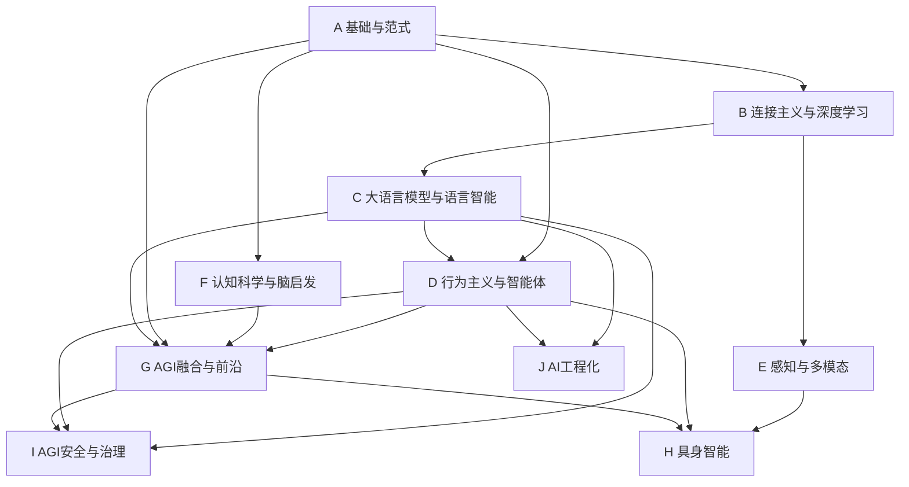

---
tags:
  - 导航
  - AGI路线图
  - 知识地图
  - 学习路径
created: 2026-07-28
updated: 2026-07-28
---

# AGI 知识地图

> **角色**：面向 AGI 演进的完整知识导航。以 AGI 技术路线为主轴组织全部知识方向，提供板块-方向两级导航、AGI 阶梯映射和三大范式定位。

---

## 一、AGI 技术路线

```
语言模型 ──→ CoT思维链 ──→ Agent ──→ 持续学习 ──→ 奇点(自我迭代) ──→ 具身智能
  (1)已完成     (2)已完成    (3)当前台阶   (4)最大瓶颈     (5)远期目标     (6)最终阶段
```

| 阶梯 | 核心能力 | 对应板块 | 核心方向 | 范式归属 |
|------|----------|----------|----------|----------|
| 1. 语言模型 | 理解与生成 | C_大语言模型 | PLM, LLM架构 | 连接主义 |
| 2. CoT思维链 | 自主推理 | C_大语言模型 | 推理模型与思维链 | 连接主义 |
| 3. Agent | 工具调用与任务执行 | D_行为主义 | Agent系统 | 行为主义+连接 |
| 4. 持续学习 | 像人一样持续积累 | D_行为主义 | 持续学习与元学习 | ★当前瓶颈★ |
| 5. 奇点 | 自我迭代开发AI | G_AGI融合 | AutoML与自优化 | 多范式融合 |
| 6. 具身智能 | 进入物理世界 | H_具身智能 | 具身智能全方向 | 行为主义+连接 |

---

## 二、三大 AI 范式

```
┌──────────────────────────────────────────────────────────┐
│                     AGI = 范式融合                          │
│                                                            │
│   符号主义             连接主义            行为主义          │
│   ┌─────────┐       ┌──────────┐       ┌──────────┐      │
│   │ 逻辑推理  │       │ 深度学习   │       │ 强化学习   │      │
│   │ 知识表示  │       │ LLM       │       │ Agent     │      │
│   │ 规划搜索  │       │ 表征学习   │       │ 进化计算   │      │
│   │ 专家系统  │       │ 生成模型   │       │ 群体智能   │      │
│   └────┬────┘       └─────┬────┘       └─────┬────┘      │
│        │                  │                   │           │
│        └──────────┬───────┘                   │           │
│                   │                           │           │
│            神经符号融合                 行为+连接融合        │
│            因果AI                     Agent+持续学习       │
│            可解释AI                                        │
└──────────────────────────────────────────────────────────┘
```

| 范式 | 核心信念 | 板块 | 在 AGI 中的角色 |
|------|----------|------|----------------|
| 符号主义 | 智能即符号操作与逻辑推理 | A.04 | 知识表示、推理、验证、规划 |
| 连接主义 | 智能即模式识别与学习 | B, C | 感知、生成、泛化、语义理解 |
| 行为主义 | 智能即与环境交互的适应 | D | 行动、试错、优化、Agent |

---

## 三、板块-方向导航

### A 基础与范式

| 序号 | 方向 | 核心主题 | AGI定位 |
|------|------|----------|---------|
| 01 | [[A_基础与范式/01_数学基础/00_数学基础_综述\|数学基础]] | 线性代数、微积分、概率论、信息论、概率图模型 | 一切理论基础 |
| 02 | [[A_基础与范式/02_优化理论与方法/00_优化理论与方法_综述\|优化理论与方法]] | 梯度下降、Adam、凸优化、分布式优化 | 训练与推理的数学引擎 |
| 03 | [[A_基础与范式/03_机器学习/00_机器学习_综述\|机器学习]] | 监督/无监督学习、集成学习、SVM、EM | AI方法论基础 |
| 04 | [[A_基础与范式/04_符号主义AI/00_符号AI与知识表示_综述\|符号主义AI]] | 自动机、逻辑推理、知识表示、专家系统、规划、知识图谱 | 符号主义范式核心 |
| 05 | [[A_基础与范式/05_AI发展史/00_AI发展史总览\|AI发展史]] | 从图灵测试到Agent时代的完整历史 | 范式演变的叙事 |

### B 连接主义与深度学习

| 序号 | 方向 | 核心主题 | AGI定位 |
|------|------|----------|---------|
| 01 | [[B_连接主义与深度学习/01_深度学习基础/00_深度学习基础_综述\|深度学习基础]] | 反向传播、激活函数、正则化、BatchNorm | 连接主义范式基础 |
| 02 | [[B_连接主义与深度学习/02_卷积神经网络/00_卷积神经网络_综述\|卷积神经网络]] | CNN架构、ResNet、检测、分割 | 视觉表征基石 |
| 03 | [[B_连接主义与深度学习/03_序列模型/00_序列模型_综述\|序列模型]] | RNN、LSTM、GRU、Mamba/SSM | 序列建模基础 |
| 04 | [[B_连接主义与深度学习/04_生成模型/00_生成模型_综述\|生成模型]] | GAN、VAE、扩散模型、Flow Matching | 生成能力与数据增强 |
| 05 | [[B_连接主义与深度学习/05_Transformer与注意力机制/00_Transformer与注意力机制_综述\|Transformer与注意力机制]] | Self-Attention、MHA、RoPE、FlashAttention | 现代架构核心 |
| 06 | [[B_连接主义与深度学习/06_图神经网络/00_图神经网络_综述\|图神经网络]] | GCN、GAT、GIN、消息传递 | 结构化数据表征 |
| 07 | [[B_连接主义与深度学习/07_自监督学习/00_自监督学习_综述\|自监督学习]] ★ | 对比学习、掩码预测、自蒸馏 | 大规模预训练基础范式 |

### C 大语言模型与语言智能

| 序号 | 方向 | 核心主题 | AGI定位 |
|------|------|----------|---------|
| 01 | [[C_大语言模型与语言智能/01_预训练语言模型/00_预训练语言模型_综述\|预训练语言模型]] | BERT、GPT、T5、Scaling Laws | AGI阶梯1：语言模型 |
| 02 | [[C_大语言模型与语言智能/02_大语言模型核心架构/00_大语言模型核心架构_综述\|大语言模型核心架构]] | MoE、SwiGLU、MLA、GQA、长上下文 | 语言模型的核心设计 |
| 03 | [[C_大语言模型与语言智能/03_大模型训练与对齐/00_大模型训练与对齐_综述\|大模型训练与对齐]] | SFT、RLHF、DPO、GRPO、LoRA | 模型能力的关键锻造 |
| 04 | [[C_大语言模型与语言智能/04_大模型推理与优化/00_大模型推理与优化_综述\|大模型推理与优化]] | KV-Cache、量化、投机解码、vLLM | 模型部署的关键环节 |
| 05 | [[C_大语言模型与语言智能/05_自然语言处理/00_自然语言处理_综述\|自然语言处理]] | 分词、CRF、信息检索、机器翻译 | 语言理解的应用层 |
| 06 | [[C_大语言模型与语言智能/06_知识蒸馏与模型压缩/00_知识蒸馏与模型压缩_综述\|知识蒸馏与模型压缩]] | 软标签蒸馏、剪枝、低秩分解 | 模型效率优化 |

### D 行为主义与智能体

| 序号 | 方向 | 核心主题 | AGI定位 |
|------|------|----------|---------|
| 01 | [[D_行为主义与智能体/01_强化学习/00_强化学习_综述\|强化学习]] | MDP、Q-Learning、DQN、PPO、GRPO、博弈论 | 行为主义范式核心 |
| 02 | [[D_行为主义与智能体/02_LLM应用工程/00_LLM应用工程_综述\|LLM应用工程]] | 提示工程、RAG、工作流、应用评估 | LLM应用落地 |
| 03 | [[D_行为主义与智能体/03_进化与群体智能/00_进化与群体智能_综述\|进化与群体智能]] ★ | 遗传算法、PSO、ACO、自组织系统 | 行为主义路线的无梯度优化 |
| 04 | [[D_行为主义与智能体/04_Agent系统/00_Agent系统_综述\|Agent系统]] ★ | ReAct、MCP、多Agent、记忆、规划 | **AGI阶梯3：当前台阶** |
| 05 | [[D_行为主义与智能体/05_持续学习与元学习/00_持续学习与元学习_综述\|持续学习与元学习]] ★ | EWC、MAML、小样本学习、终身学习 | **AGI阶梯4：最大瓶颈** |

### E 感知与多模态

| 序号 | 方向 | 核心主题 | AGI定位 |
|------|------|----------|---------|
| 01 | [[E_感知与多模态/01_计算机视觉/00_计算机视觉_综述\|计算机视觉]] | 传统CV、CNN检测、NeRF、SAM | 感知子系统（视觉） |
| 02 | [[E_感知与多模态/02_多模态AI/00_多模态AI_综述\|多模态AI]] | CLIP、LLaVA、图像/视频生成、语音 | 多模态是AGI组件而非主线 |

### F 认知科学与脑启发

| 序号 | 方向 | 核心主题 | AGI定位 |
|------|------|----------|---------|
| 01 | [[F_认知科学与脑启发/01_认知架构与记忆/00_认知架构与记忆_综述\|认知架构与记忆]] ★ | ACT-R、SOAR、工作记忆、元认知 | 理解智能本质的交叉学科 |
| 02 | [[F_认知科学与脑启发/02_脑启发与神经形态计算/00_脑启发与神经形态计算_综述\|脑启发与神经形态计算]] ★ | SNN、类脑芯片、事件相机 | 可能的范式突破方向 |

### G AGI融合与前沿

| 序号 | 方向 | 核心主题 | AGI定位 |
|------|------|----------|---------|
| 01 | [[G_AGI融合与前沿/01_神经符号融合与因果AI/00_神经符号融合与因果AI_综述\|神经符号融合与因果AI]] ★ | Neuro-Symbolic、因果AI、XAI | AGI关键突破口 |
| 02 | [[G_AGI融合与前沿/02_世界模型与物理智能/00_世界模型与物理智能_综述\|世界模型与物理智能]] ★ | Dreamer、JEPA、3D场景、因果世界模型 | Agent的预测基础 |
| 03 | [[G_AGI融合与前沿/03_AutoML与自优化系统/00_AutoML与自优化系统_综述\|AutoML与自优化系统]] ★ | NAS、超参优化、递归自我改进 | AGI阶梯5：奇点路径 |

### H 具身智能

| 序号 | 方向 | 核心主题 | AGI定位 |
|------|------|----------|---------|
| 01 | [[H_具身智能/01_具身智能/00_具身智能_综述\|具身智能]] | 本体+感知+决策+控制+仿真+安全 | **AGI阶梯6：最终阶段** |

### I AGI安全与治理

| 序号 | 方向 | 核心主题 | AGI定位 |
|------|------|----------|---------|
| 01 | [[I_AGI安全与治理/01_AI安全与对齐/00_AI安全与对齐_综述\|AI安全与对齐]] | 对抗攻防、差分隐私、可解释性、价值对齐 | AGI的必要安全约束 |

### J AI工程化

| 序号 | 方向 | 核心主题 | AGI定位 |
|------|------|----------|---------|
| 01 | [[J_AI工程化/01_模型部署与工程化/00_模型部署与工程化_综述\|模型部署与工程化]] | 服务化、容器化、MLOps、硬件加速 | 工程落地支撑 |

> ★ 标记为本次新增方向

---

## 四、板块依赖关系



---

## 五、学习路径

### 路径1：AGI 主线（核心闭环）

1. **A 基础**：数学 → 优化 → 机器学习 → 符号主义AI
2. **B 连接主义**：深度学习 → Transformer → 自监督学习
3. **C 大语言模型**：PLM → LLM架构 → 训练与对齐 → 推理优化
4. **D 行为主义**：强化学习 → Agent系统 → 持续学习（瓶颈）
5. **G 融合前沿**：神经符号融合 → 世界模型 → AutoML（奇点）
6. **H 具身智能**：本体 → 感知 → 决策 → 控制（终点）

### 路径2：感知与多模态（应用闭环）

1. A 基础 → B 连接主义（CNN/Transformer）
2. E 感知（CV + 多模态AI）
3. H 具身智能（感知→决策→控制）

### 路径3：认知与融合（研究闭环）

1. A 基础（符号主义 + 机器学习）
2. F 认知科学（认知架构 + 脑启发）
3. G 融合前沿（神经符号 + 因果AI + 世界模型）
4. I 安全治理

---

## 六、标签体系

- **范式标签**：`#符号主义` `#连接主义` `#行为主义` `#融合路线`
- **AGI阶梯标签**：`#语言模型` `#CoT` `#Agent` `#持续学习` `#奇点` `#具身智能`
- **阶段标签**：`#已完成` `#当前台阶` `#瓶颈` `#远期目标` `#最终阶段`
- **类型标签**：`#公式推导` `#论文精读` `#代码实践` `#理论分析` `#工程经验`
