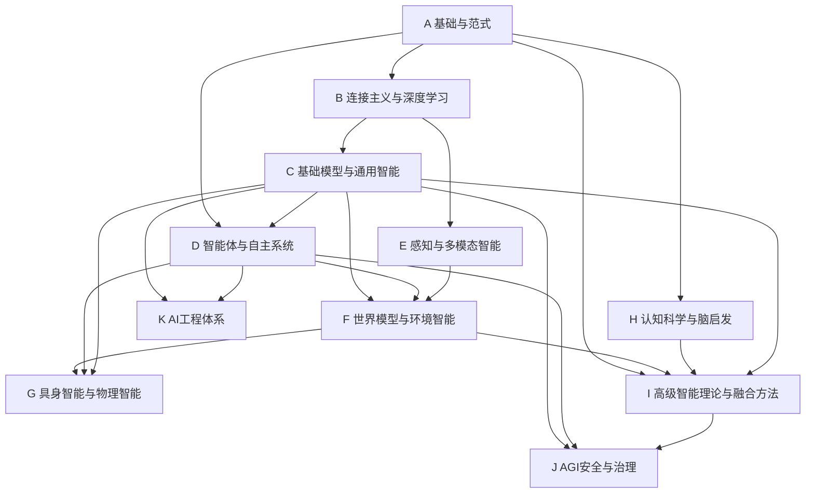

---
tags:
  - 导航
  - AGI路线图
  - 知识地图
  - 学习路径
created: 2026-07-28
updated: 2026-07-28
---

# AGI 知识地图

> **角色**：面向 AGI 演进的完整知识导航。以 AGI 技术路线为主轴组织全部知识方向，提供板块-方向两级导航、AGI 阶梯映射和三大范式定位。

---

## 一、AGI 技术路线

```
语言模型 ──→ CoT思维链 ──→ Agent ──→ 持续学习 ──→ 奇点(自我迭代) ──→ 具身智能
  (1)已完成     (2)已完成    (3)当前台阶   (4)最大瓶颈     (5)远期目标     (6)最终阶段
```

基础模型的演进路径：
```
LLM → VLM → WFM → AFM
语言   视觉   世界   行动
```

| 阶梯 | 核心能力 | 对应板块 | 核心方向 | 范式归属 |
|------|----------|----------|----------|----------|
| 1. 语言模型 | 理解与生成 | C_基础模型 | 语言/视觉/多模态/行动基础模型 | 连接主义 |
| 2. CoT思维链 | 自主推理 | C_基础模型 | 推理与思考 | 连接主义 |
| 3. Agent | 工具调用与任务执行 | D_智能体 | Agent理论+工程 | 行为主义+连接 |
| 4. 持续学习 | 像人一样持续积累 | D_智能体 | 持续学习与自我改进 | ★当前瓶颈★ |
| 5. 智能统一与能力增长 | 机制理解、开放学习与受控自我改进 | I_高级智能理论 | 智能统一、推理、因果、开放式智能 | 多范式融合 |
| 6. 具身智能 | 进入物理世界 | G_具身智能 | 具身智能+VLA全方向 | 行为主义+连接 |

---

## 二、三大 AI 范式

```
┌──────────────────────────────────────────────────────────┐
│                     AGI = 范式融合                          │
│                                                            │
│   符号主义             连接主义            行为主义          │
│   ┌─────────┐       ┌──────────┐       ┌──────────┐      │
│   │ 逻辑推理  │       │ 深度学习   │       │ 强化学习   │      │
│   │ 知识表示  │       │ 基础模型   │       │ Agent     │      │
│   │ 规划搜索  │       │ 表征学习   │       │ 进化计算   │      │
│   │ 专家系统  │       │ 生成模型   │       │ 群体智能   │      │
│   └────┬────┘       └─────┬────┘       └─────┬────┘      │
│        │                  │                   │           │
│        └──────────┬───────┘                   │           │
│                   │                           │           │
│            神经符号融合                 行为+连接融合        │
│            因果智能                     Agent+持续学习       │
│            可解释AI                                        │
└──────────────────────────────────────────────────────────┘
```

| 范式 | 核心信念 | 板块 | 在 AGI 中的角色 |
|------|----------|------|----------------|
| 符号主义 | 智能即符号操作与逻辑推理 | A.04 | 知识表示、推理、验证、规划 |
| 连接主义 | 智能即模式识别与学习 | B, C | 感知、生成、泛化、语义理解 |
| 行为主义 | 智能即与环境交互的适应 | D | 行动、试错、优化、Agent |
| 概率路线 | 智能即不确定世界中的推断 | A.06 | 不确定性建模、贝叶斯更新、持续学习 |
| 因果路线 | 智能即理解因果关系 | I.02 | 干预、反事实、因果发现 |

---

## 三、板块-方向导航

### A 基础与范式

| 序号 | 方向 | 核心主题 | AGI定位 |
|------|------|----------|---------|
| 01 | [[A_基础与范式/01_数学基础/00_数学基础_综述\|数学基础]] | 线性代数、微积分、概率论、信息论、矩阵分析、随机过程、图论、动力系统、博弈论 | 一切理论基础 |
| 02 | [[A_基础与范式/02_优化理论与方法/00_优化理论与方法_综述\|优化理论与方法]] | 梯度下降、Adam、凸优化、分布式优化 | 训练与推理的数学引擎 |
| 03 | [[A_基础与范式/03_机器学习/00_机器学习_综述\|机器学习]] | 监督/无监督学习、集成学习、SVM、EM | AI方法论基础 |
| 04 | [[A_基础与范式/04_符号主义AI/00_符号AI与知识表示_综述\|符号主义AI]] | 自动机、逻辑推理、知识表示、专家系统、规划、知识图谱 | 符号主义范式核心 |
| 05 | [[A_基础与范式/05_AI发展史/00_AI发展史总览\|AI发展史]] | 从图灵测试到Agent时代的完整历史 | 范式演变的叙事 |
| 06 | [[A_基础与范式/06_概率机器学习与贝叶斯智能/00_概率机器学习与贝叶斯智能_综述\|概率机器学习与贝叶斯智能]] ★ | 贝叶斯推断、概率图模型、不确定性估计、主动学习 | 不确定世界中的推断与决策 |
### B 连接主义与深度学习

| 序号 | 方向 | 核心主题 | AGI定位 |
|------|------|----------|---------|
| 01 | [[B_连接主义与深度学习/01_深度学习基础/00_深度学习基础_综述\|深度学习基础]] | 反向传播、优化、训练稳定性与实验管理 | 连接主义训练基础 |
| 02 | [[B_连接主义与深度学习/02_深度学习理论/00_深度学习理论_综述\|深度学习理论]] ★ | 表达能力、泛化、过参数化、Scaling | 连接主义的解释框架 |
| 03 | [[B_连接主义与深度学习/03_卷积神经网络与视觉学习/00_卷积神经网络_综述\|CNN与视觉学习]] | CNN架构、残差学习、视觉任务机制 | 视觉表征基础 |
| 04 | [[B_连接主义与深度学习/04_序列模型/00_序列模型_综述\|序列模型]] | RNN、注意力演化、SSM、Mamba | 序列建模基础 |
| 05 | [[B_连接主义与深度学习/05_表示学习/00_表示学习_综述\|表示学习]] ★ | Embedding、度量、几何、解耦与迁移 | 所有AI的核心横切关注点 |
| 06 | [[B_连接主义与深度学习/06_自监督学习/00_自监督学习_综述\|自监督学习]] ★ | 对比学习、掩码预测、自蒸馏 | 大规模预训练基础范式 |
| 07 | [[B_连接主义与深度学习/07_生成模型/00_生成模型_综述\|生成模型]] | GAN、VAE、扩散、流与生成式基础模型 | 生成能力与数据建模 |
| 08 | [[B_连接主义与深度学习/08_Transformer与注意力机制/00_Transformer与注意力机制_综述\|Transformer]] | 注意力、MoE、长上下文与高效计算 | 现代通用架构 |
| 09 | [[B_连接主义与深度学习/09_图神经网络/00_图神经网络_综述\|图神经网络]] | 消息传递、图Transformer、图表示学习 | 结构化数据表征 |
| 10 | [[B_连接主义与深度学习/10_神经架构搜索NAS与自动化设计/00_神经架构搜索NAS_综述\|NAS与自动化设计]] | DARTS、可微搜索、一次性NAS、LLM驱动 | 自动化AI研究分支 |

### C 基础模型与通用智能

> **C = Foundation Model层**：关注如何训练通用模型（CLIP、SAM、DINO、GPT、LLaVA、Gemini等）

| 序号 | 方向 | 核心主题 | AGI定位 |
|------|------|----------|---------|
| 01 | [[C_基础模型与通用智能/01_基础模型理论/00_基础模型理论_综述\|基础模型理论]] ★ | Scaling Laws、预训练范式、涌现能力、Foundation Model | AGI阶梯1：通用预训练 |
| 02 | [[C_基础模型与通用智能/02_语言基础模型/00_预训练语言模型_综述\|语言基础模型]] | BERT、GPT、T5、LLM核心架构、Scaling Laws、NLP历史 | AGI阶梯1：语言模型 |
| 03 | [[C_基础模型与通用智能/03_视觉基础模型/00_视觉基础模型_综述\|视觉基础模型]] ★ | ViT、MAE、DINO、CLIP、视频基础模型 | 基础模型向视觉扩展 |
| 04 | [[C_基础模型与通用智能/04_多模态基础模型/00_多模态基础模型_综述\|多模态基础模型]] ★ | VLM、Gemini、LLaVA、统一多模态、视频生成 | 基础模型向多模态扩展 |
| 05 | [[C_基础模型与通用智能/05_世界模型基础/00_世界模型基础_综述\|世界模型基础]] ★ | 潜在动力学、Dreamer、JEPA、视频世界模型、环境预测 | 感知、预测、规划与行动的模型接口 |
| 06 | [[C_基础模型与通用智能/06_模型训练与对齐/00_大模型训练与对齐_综述\|模型训练与对齐]] | 预训练、SFT、RLHF、DPO、GRPO、LoRA、持续学习/Agent 对齐接口 | 模型能力与默认行为的关键锻造 |
| 07 | [[C_基础模型与通用智能/07_行动基础模型/00_行动基础模型_综述\|行动基础模型]] ★ | VLA、动作表示、通用策略模型、模仿学习 | 基础模型向行动扩展，连接 G 的物理执行 |
| 08 | [[C_基础模型与通用智能/08_推理与思考/00_推理与思维链_综述\|推理与思考]] ★ | CoT、自洽、树/图搜索、测试时计算、验证 | **AGI阶梯2：推理 ≠ 生成** |
| 09 | [[C_基础模型与通用智能/09_模型压缩与高效推理/00_模型压缩与高效推理_综述\|模型压缩与高效推理]] | 蒸馏、量化、剪枝、KV-Cache、推理加速、成本与延迟权衡 | 能力的可部署性与成本边界 |
| 10 | [[C_基础模型与通用智能/10_推理算法/00_推理算法_综述\|推理算法]] | 解码与采样、投机解码、长上下文策略、推理时扩展 | 推理阶段的生成策略与效率算法 |

### D 智能体与自主系统

| 序号 | 方向 | 核心主题 | AGI定位 |
|------|------|----------|---------|
| 01 | [[D_智能体与自主系统/01_智能体理论基础/00_智能体理论基础_综述\|智能体理论基础]] ★ | Agent 定义与理性、决策理论与 BDI、认知架构 | 理性主体理论基础 |
| 02 | [[D_智能体与自主系统/02_环境与世界模型/00_环境与世界模型_综述\|环境与世界模型]] | POMDP、交互环境、状态表示、世界模型与心理模拟 | 智能体的环境接口 |
| 03 | [[D_智能体与自主系统/03_规划与推理/00_规划与推理_综述\|规划与推理]] | STRIPS/PDDL/HTN、搜索与 MCTS、LLM 规划、层次规划 | 从目标到行动 |
| 04 | [[D_智能体与自主系统/04_强化学习/00_强化学习_综述\|强化学习]] | MDP、Q-Learning、DQN、PPO、博弈论、逆RL | 行为主义范式核心 |
| 05 | [[D_智能体与自主系统/05_记忆与持续学习/00_记忆与持续学习_综述\|记忆与持续学习]] ★ | Agent 记忆、记忆架构与检索、持续学习、元学习 | **AGI阶梯4：最大瓶颈** |
| 06 | [[D_智能体与自主系统/06_Agent工程系统/00_Agent工程系统_综述\|Agent工程系统]] ★ | Runtime与治理、工具调用与MCP、工作流编排、RAG、提示工程 | Agent的工程落地 |
| 07 | [[D_智能体与自主系统/07_Multi-Agent系统/00_Multi-Agent系统_综述\|Multi-Agent系统]] ★ | MAS理论通信、协作竞争与任务分配、LLM Multi-Agent | 多智能体协作 |
| 08 | [[D_智能体与自主系统/08_进化智能/00_进化智能_综述\|进化智能]] ★ | 遗传算法与进化策略、神经进化、群体智能与自组织 | 行为主义路线的无梯度优化 |

#### Agent工程系统子方向

| 子方向 | 核心主题 |
|--------|----------|
| [[D_智能体与自主系统/06_Agent工程系统/00_运行时与治理/01_Agent_Runtime\|Agent Runtime]] | 运行时架构、生命周期管理 |
| [[D_智能体与自主系统/06_Agent工程系统/00_运行时与治理/02_监控_评测与安全治理\|监控与安全治理]] | 监控、评测与安全治理 |
| [[D_智能体与自主系统/06_Agent工程系统/01_工具调用与MCP/00_工具调用与MCP_综述\|工具调用与MCP]] | Function Calling、MCP协议、代码执行 |
| [[D_智能体与自主系统/06_Agent工程系统/02_工作流与编排/00_Agent工作流\|工作流与编排]] | Agent工作流、自动化工作流、DAG编排 |
| [[D_智能体与自主系统/06_Agent工程系统/03_RAG与检索增强/00_RAG系统\|RAG与检索增强]] | 基础RAG、进阶RAG、多模态RAG、向量数据库 |
| [[D_智能体与自主系统/06_Agent工程系统/04_评测与可观测性/00_LLM应用评估与可观测性\|评测与可观测性]] | Agent评测、应用可观测性 |

### E 感知与多模态智能

> **E = 感知能力层**：关注AI如何理解世界（视觉、语音、多模态、空间），与C（如何训练通用模型）边界清晰

| 序号 | 方向 | 核心主题 | AGI定位 |
|------|------|----------|---------|
| 00 | [[E_感知与多模态智能/00_感知智能综述\|感知智能综述]] | 信号→表示→理解→空间/时空状态→行动接口 | AGI 感知能力层 |
| 01 | [[E_感知与多模态智能/01_视觉表示与视觉理解/00_视觉智能综述\|视觉表示与视觉理解]] | 图像表示、检测、分割、开放词汇与 Grounding | 视觉观测到结构化状态 |
| 02 | [[E_感知与多模态智能/02_视频与时空智能/00_视频智能综述\|视频与时空智能]] | 视频表示、跟踪、事件、长视频记忆 | 连续环境观测 |
| 03 | [[E_感知与多模态智能/03_多模态理解与对齐/00_多模态智能综述\|多模态理解与对齐]] | VLM、对齐、融合、跨模态证据推理 | 语义 grounding 与证据融合 |
| 04 | [[E_感知与多模态智能/04_语音与音频智能/00_语音与音频智能综述\|语音与音频智能]] ★ | ASR、声学表示、音频理解与音视联合 | 听觉感知子系统 |
| 05 | [[E_感知与多模态智能/05_三维空间智能/00_空间智能综述\|三维空间智能]] ★ | 三维几何、SLAM、场景理解、空间推理 | 世界模型与具身系统的空间基础 |
| 06 | [[E_感知与多模态智能/06_统一多模态感知/00_统一多模态感知综述\|统一多模态感知]] | 全模态输入输出、同步、缺失模态与评估 | 统一观测状态 |
| 07 | [[E_感知与多模态智能/07_感知与行动接口/00_感知行动接口综述\|感知与行动接口]] | 主动感知、状态估计、VLM/VLA 输入接口 | 连接 D/F/G 的感知桥梁 |
| 08 | [[E_感知与多模态智能/08_感知数据与评测/00_感知数据与评测综述\|感知数据与评测]] | 数据集、开放世界鲁棒性与闭环评测 | 感知能力度量衡 |

### F 世界模型与环境智能 ★提升

> **F = 环境闭环层**：从多模态观测中形成可行动状态，预测未来、模拟后果、规划行动，并通过交互持续更新。它连接 E 感知、C 基础模型、D Agent 与 G 具身智能。

| 序号 | 方向 | 核心主题 | AGI定位 |
|------|------|----------|---------|
| 00 | [[F_世界模型与环境智能/00_世界模型综述\|世界模型综述]] ★ | 表示→预测→模拟→规划→交互→评估的完整闭环 | 从知识智能到环境智能的系统桥梁 |
| 01 | [[F_世界模型与环境智能/01_世界模型理论/00_世界模型理论_综述\|世界模型理论]] ★ | Model-Based RL、潜在动力学、预测学习、JEPA | 行动条件下的未来预测 |
| 02 | [[F_世界模型与环境智能/02_世界表示学习/00_世界表示学习_综述\|世界表示学习]] ★ | 状态、空间、时间、因果表示 | 从感知证据到可行动世界状态 |
| 03 | [[F_世界模型与环境智能/03_生成式世界模型/00_生成式世界模型_综述\|生成式世界模型]] | 视频、扩散、交互式生成模拟器 | 高容量未来与长尾情景模拟 |
| 04 | [[F_世界模型与环境智能/04_环境模拟与数字孪生/00_环境模拟与数字孪生_综述\|环境模拟与数字孪生]] ★ | 物理引擎、数字孪生、神经模拟、Sim2Real | 世界模型的训练场与现实校准器 |
| 05 | [[F_世界模型与环境智能/05_世界模型驱动智能体/00_世界模型驱动智能体_综述\|世界模型驱动智能体]] ★ | 规划、想象式 RL、LLM/具身 Agent | 预测后果再选择行动 |
| 06 | [[F_世界模型与环境智能/06_环境智能与交互/00_环境智能与交互_综述\|环境智能与交互]] | 交互学习、探索、环境接口、多智能体 | 从被动预测到主动适应 |
| 07 | [[F_世界模型与环境智能/07_世界模型评估与前沿/00_世界模型评估与前沿_综述\|评估与前沿]] | 长程、物理、因果、泛化与闭环任务评估 | 世界理解能力的度量衡 |

> 世界模型不是“前沿杂项”，而是 AGI 架构核心候选：**感知 → 世界模型 → Agent**，并向下支撑具身行动与环境智能。

### G 具身智能与物理智能

| 序号 | 方向 | 核心主题 | AGI定位 |
|------|------|----------|---------|
| 00 | [[G_具身智能与物理智能/00_具身智能综述/00_具身智能综述\|具身智能综述]] ★ | 身体—感知—学习—预测—行动闭环 | Physical AGI 总导航 |
| 01 | [[G_具身智能与物理智能/01_机器人身体与系统/00_机器人身体与系统_综述\|机器人身体与系统]] | 本体、运动学、操作、ROS 2 与实时系统 | 物理能力与工程边界 |
| 02 | [[G_具身智能与物理智能/02_具身感知/00_具身感知_综述\|具身感知]] | 多模态、3D、空间、可供性、主动感知 | 为行动构建状态 |
| 03 | [[G_具身智能与物理智能/03_机器人学习/00_机器人学习_综述\|机器人学习]] ★ | 模仿学习、RL、技能、自监督、数据工程 | 从数据和交互获得技能 |
| 04 | [[G_具身智能与物理智能/04_具身世界模型/00_具身世界模型_综述\|具身世界模型]] ★ | 物理预测、想象、仿真、模型规划 | 预测行动后果 |
| 05 | [[G_具身智能与物理智能/05_具身规划与决策/00_具身规划与决策_综述\|具身规划与决策]] ★ | 任务—运动规划、技能组合、VLA 决策 | 从目标到可执行行动 |
| 06 | [[G_具身智能与物理智能/06_控制与执行/00_控制与执行_综述\|控制与执行]] | 控制理论、学习控制、Sim2Real、安全 | 稳定、安全地做到 |
| 07 | [[G_具身智能与物理智能/07_机器人平台/00_机器人平台_综述\|机器人平台]] | 人形、机械臂、移动、四足、无人机 | 多形态物理载体 |
| 08 | [[G_具身智能与物理智能/08_具身Agent/00_具身Agent_综述\|具身Agent]] ★ | 记忆、语言落地、恢复、长程自主 | **AGI 阶梯 6：物理自主体** |
| 09 | [[G_具身智能与物理智能/09_具身基础模型/00_具身基础模型_综述\|具身基础模型]] ★ | Robotics FM、VLM、VLA、扩散策略、跨本体 | 基础模型向物理行动扩展 |

> Foundation Model → World Model → Embodied Agent → Robot Body → Environment Learning。具身智能是智能从数字世界走向物理世界的闭环系统。

### H 认知科学与脑启发

| 序号 | 方向 | 核心主题 | AGI定位 |
|------|------|----------|---------|
| 00 | [[H_认知科学与脑启发/00_认知科学与AGI综述\|认知科学与 AGI 综述]] ★ | 认知闭环、机制—原则—架构映射 | **AGI 的智能机制理论层** |
| 01 | [[H_认知科学与脑启发/01_大脑与认知基础/00_大脑与认知基础_综述\|大脑与认知基础]] | 脑系统、认知神经科学、可塑性 | 为计算假设提供机制约束 |
| 02 | [[H_认知科学与脑启发/02_认知架构/00_认知架构_综述\|认知架构]] ★ | ACT-R、SOAR、全局工作空间、LLM Agent | 组织感知—记忆—推理—行动 |
| 03 | [[H_认知科学与脑启发/03_感知与注意机制/00_感知与注意机制_综述\|感知与注意机制]] | 选择性注意、自上而下控制、主动感知 | 输入选择与有限资源调度 |
| 04 | [[H_认知科学与脑启发/04_记忆系统/00_记忆系统_综述\|记忆系统]] ★ | 工作、情景、语义、程序记忆；巩固与遗忘 | 跨时间经验与持续身份 |
| 05 | [[H_认知科学与脑启发/05_推理与决策机制/00_推理与决策机制_综述\|推理与决策机制]] ★ | 因果、贝叶斯、决策理论与认知偏差 | 从内部模型到受约束行动 |
| 06 | [[H_认知科学与脑启发/06_元认知与自我模型/00_元认知与自我模型_综述\|元认知与自我模型]] ★ | 校准、反思、能力边界、自我修正 | 可靠性与自主改进的控制层 |
| 07 | [[H_认知科学与脑启发/07_意识与自主性/00_意识与自主性_综述\|意识与自主性]] | 工作空间、IIT、自我觉察、机器意识评估 | 功能架构与伦理边界 |
| 08 | [[H_认知科学与脑启发/08_脑启发学习/00_脑启发学习_综述\|脑启发学习]] | Hebbian、STDP、预测编码、主动推理、持续学习 | 在线适应与可塑性机制 |
| 09 | [[H_认知科学与脑启发/09_神经形态计算/00_神经形态计算_综述\|神经形态计算]] | SNN、事件驱动芯片、存算一体 | 高能效时序计算路线 |

> H 以“感知—注意—记忆—推理—决策—行动—学习—自我调节”的认知闭环为主线，向 C 基础模型、D Agent、F 世界模型和 G 具身智能提供机制解释与架构启发。意识研究作为独立方向，需区分可工程化的功能机制与尚无定论的主观体验主张。

### I 高级智能理论与融合方法

| 序号 | 方向 | 核心主题 | AGI定位 |
|------|------|----------|---------|
| 00 | [[I_高级智能理论与融合方法/00_AGI理论与智能统一框架/00_AGI理论与智能统一框架_综述\|AGI理论与智能统一框架]] ★ | 智能定义、通用性、认知架构、能力度量 | 智能机制的理论顶层 |
| 01 | [[I_高级智能理论与融合方法/01_神经符号智能/00_神经符号智能_综述\|神经符号智能]] ★ | 知识表示、LLM推理、程序综合、形式验证 | 学习与可验证推理融合 |
| 02 | [[I_高级智能理论与融合方法/02_因果智能/00_因果智能_综述\|因果智能]] ★ | SCM、因果发现、反事实、因果世界模型 | 从相关到机制理解 |
| 03 | [[I_高级智能理论与融合方法/03_通用推理与抽象智能/00_通用推理与抽象智能_综述\|通用推理与抽象智能]] ★ | 抽象、类比、组合泛化、程序求解 | 跨任务可迁移推理 |
| 04 | [[I_高级智能理论与融合方法/04_AI自动化与自我改进/00_AI自动化与自我改进_综述\|AI自动化与自我改进]] | AutoML、AI Scientist、受控递归改进 | 能力增长与科学发现闭环 |
| 05 | [[I_高级智能理论与融合方法/05_复杂系统与涌现智能/00_复杂系统与涌现智能_综述\|复杂系统与涌现智能]] | 复杂适应系统、自组织、群体智能 | 智能的系统机制 |
| 06 | [[I_高级智能理论与融合方法/06_人工生命与进化智能/00_人工生命与进化智能_综述\|人工生命与进化智能]] | ALife、进化计算、神经进化、人工生态 | 适应与演化机制 |
| 07 | [[I_高级智能理论与融合方法/07_开放式智能/00_开放式智能_综述\|开放式智能]] ★ | 开放式学习、内在动机、自主技能获取 | 持续发现与能力积累 |

> I 板块以“统一理论 → 表示与世界理解 → 通用推理 → 能力增长 → 系统涌现与开放演化”为主线，研究通用智能的计算原理、边界与可验证架构。

### J AGI安全与治理

| 序号 | 方向 | 核心主题 | AGI定位 |
|------|------|----------|---------|
| 01 | [[J_AGI安全与治理/00_AGI安全与治理_综述\|AGI安全与治理]] | 安全理论、对齐、模型与 Agent 安全、安全工程、责任 AI、治理与长期控制 | AGI 全生命周期的安全约束与社会治理 |

### K AI工程体系

| 序号 | 方向 | 核心主题 | AGI定位 |
|------|------|----------|---------|
| 01 | [[K_AI工程化/01_数据工程与合成数据/00_数据工程与合成数据_综述\|数据工程与合成数据]] ★ | 数据构造、合成数据、数据增强、数据质量 | AI时代：数据 > 模型 |
| 02 | [[K_AI工程化/02_训练工程/00_训练工程_综述\|训练工程]] ★ | 分布式训练、3D并行、训练稳定性、长上下文训练 | 从模型到产品的关键锻造 |
| 03 | [[K_AI工程化/03_推理工程/00_推理工程_综述\|推理工程]] | LLM Serving、KV-Cache、投机解码、量化与压缩、vLLM/TensorRT、ONNX、云端部署 | 推理服务与优化 |
| 04 | [[K_AI工程化/04_AI系统架构/00_AI系统架构_综述\|AI系统架构]] ★ | Agent系统架构、RAG架构、多模型协同、模型路由 | 大模型时代的应用架构设计 |
| 05 | [[K_AI工程化/05_MLOps/00_MLOps综述\|MLOps]] ★ | 模型服务化、API治理、容器化、监控与日志、版本管理与回滚、成本控制、数据隐私与合规 | AI系统的企业级运维 |
| 06 | [[K_AI工程化/06_LLMOps与AgentOps/00_LLMOps与AgentOps综述\|LLMOps与AgentOps]] ★ | Prompt生命周期、RAG运行管理、模型网关、LLM Trace、Agent部署与治理 | LLM/Agent 的专属运维 |
| 07 | [[K_AI工程化/07_AI评测体系/00_AI评测体系_综述\|AI评测体系]] ★ | 模型能力与LLM Benchmark、多模态评测、Agent评测、RAG评测、安全评测、人类偏好评测 | AGI进步的度量衡 |
| 08 | [[K_AI工程化/08_AI基础设施/00_AI基础设施综述\|AI基础设施]] | GPU与CUDA生态、Kubernetes与GPU调度、分布式存储与网络、云原生AI | AI的物理底座 |
| 09 | [[K_AI工程化/09_AI可靠性工程/00_AI可靠性工程综述\|AI可靠性工程]] | SLO与容错设计、模型失败与漂移处理、事件响应与恢复 | 生产级AI的可靠性保障 |

### 交叉学科地图（参考体系，非技术主线）

> 交叉学科基础不是AGI技术路线，而是理解智能的多维参考视角。位于 [[00_总览与导航/交叉学科地图/00_交叉学科基础_综述|交叉学科地图]] 下。

| 序号 | 方向 | 核心主题 | 参考价值 |
|------|------|----------|----------|
| 01 | [[00_总览与导航/交叉学科地图/01_认知科学\|认知科学]] | 认知架构、概念形成、类比推理 | 智能的功能架构 |
| 02 | [[00_总览与导航/交叉学科地图/02_神经科学\|神经科学]] | 大脑皮层、神经可塑性、计算神经科学 | 智能的物理实现 |
| 03 | [[00_总览与导航/交叉学科地图/03_语言学\|语言学]] | 生成语法、语义学、语言习得 | 语言智能的本质 |
| 04 | [[00_总览与导航/交叉学科地图/04_机器人学\|机器人学]] | 运动学、传感器融合、人机交互 | 具身智能的学科基础 |
| 05 | [[00_总览与导航/交叉学科地图/05_心理学\|心理学]] | 学习理论、动机与情感、发展心理学 | 行为与动机模型 |
| 06 | [[00_总览与导航/交叉学科地图/06_复杂系统\|复杂系统]] | 涌现与自组织、网络科学、多尺度建模 | AGI的系统性理解 |

---

## 四、板块依赖关系



---

## 五、学习路径

### 路径1：AGI 主线（核心闭环）

1. **A 基础**：数学 → 优化 → 机器学习 → 符号主义AI → 概率ML
2. **B 连接主义**：深度学习基础 → 深度学习理论 → 表示学习 → 自监督学习 → CNN/序列/生成/Transformer/GNN → NAS与自动化设计
3. **C 基础模型**：基础模型理论 → 语言基础模型 → 视觉/多模态/世界模型 → **行动基础模型** → 训练与对齐 → **推理与思考**
4. **D 智能体**：智能体理论基础 → 环境与世界模型 → 规划与推理 → 强化学习 → 记忆与持续学习（瓶颈） → Agent工程系统 → Multi-Agent → 进化智能
5. **F 世界模型**：世界表示 → 世界模型理论 → 生成式/物理环境模拟 → 世界模型驱动 Agent → 环境交互 → 评估
6. **G 具身智能**：机器人学基础 → 感知 → 决策 → 控制理论与执行 → VLA → 人形 → 具身Agent（终点）
7. **I 高级智能理论**：AGI理论统一框架 → 神经符号与因果智能 → 通用推理与抽象 → AI自动化与自我改进 → 涌现、进化与开放式智能

### 路径2：感知与物理智能（具身闭环）

1. A 基础 → B 连接主义（CNN/Transformer）
2. E 感知（视觉表示与理解 → 视频时空 → 多模态对齐 → 音频 → 三维空间 → 感知行动接口）
3. C 基础模型（视觉/多模态/世界/行动基础模型）
4. F 世界模型（环境理解与预测）
5. G 具身智能（感知→决策→控制→VLA→具身Agent）

### 路径3：认知与融合（研究闭环）

1. A 基础（符号主义 + 概率ML + 机器学习）
2. H 认知科学（认知架构 + 记忆系统 + 元认知 + 脑启发计算）
3. I 高级智能理论（神经符号 + 因果智能 + 复杂系统 + 人工生命 + 自动化研究）
4. J 安全治理

### 路径4：因果与概率（贝叶斯-因果路线）

1. A 基础（概率论 → 概率ML与贝叶斯智能）
2. B 连接主义（表示学习 → 自监督）
3. D 智能体（强化学习 → 逆强化学习 → 持续学习）
4. I 高级智能理论（因果智能 → 复杂系统智能 → 自动化AI研究）
5. F 世界模型（因果世界模型 → 环境智能）

### 路径5：工程与产品（落地闭环）

1. K.01 数据工程 → K.02 训练工程 → K.03 推理工程
2. K.04 AI系统架构（Agent/RAG/多模型/路由）
3. K.05 MLOps → K.06 LLMOps与AgentOps → K.07 评测体系 → K.08 基础设施 → K.09 可靠性工程
4. D.06 Agent工程系统 → J 安全治理

---

## 六、标签体系

- **范式标签**：`#符号主义` `#连接主义` `#行为主义` `#概率路线` `#因果路线` `#融合路线`
- **AGI阶梯标签**：`#语言模型` `#CoT` `#推理` `#Agent` `#持续学习` `#奇点` `#具身智能`
- **阶段标签**：`#已完成` `#当前台阶` `#瓶颈` `#远期目标` `#最终阶段`
- **类型标签**：`#公式推导` `#论文精读` `#代码实践` `#理论分析` `#工程经验`
