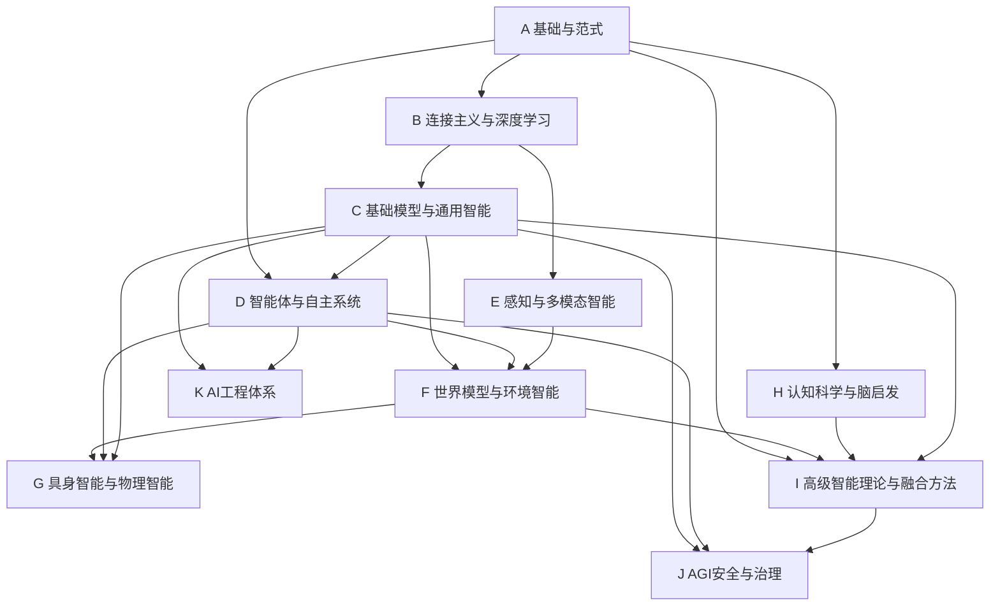

---
tags:
  - 导航
  - AGI路线图
  - 知识地图
  - 学习路径
created: 2026-07-28
updated: 2026-07-28
---

# AGI 知识地图

> **角色**：面向 AGI 演进的完整知识导航。以 AGI 技术路线为主轴组织全部知识方向，提供板块-方向两级导航、AGI 阶梯映射和三大范式定位。

---

## 一、AGI 技术路线

```
语言模型 ──→ CoT思维链 ──→ Agent ──→ 持续学习 ──→ 奇点(自我迭代) ──→ 具身智能
  (1)已完成     (2)已完成    (3)当前台阶   (4)最大瓶颈     (5)远期目标     (6)最终阶段
```

基础模型的演进路径：
```
LLM → VLM → WFM → AFM
语言   视觉   世界   行动
```

| 阶梯 | 核心能力 | 对应板块 | 核心方向 | 范式归属 |
|------|----------|----------|----------|----------|
| 1. 语言模型 | 理解与生成 | C_基础模型 | 语言/视觉/多模态/行动基础模型 | 连接主义 |
| 2. CoT思维链 | 自主推理 | C_基础模型 | 推理与思考 | 连接主义 |
| 3. Agent | 工具调用与任务执行 | D_智能体 | Agent理论+工程 | 行为主义+连接 |
| 4. 持续学习 | 像人一样持续积累 | D_智能体 | 持续学习与自我改进 | ★当前瓶颈★ |
| 5. 奇点 | 自我迭代开发AI | I_高级智能 | 自动化AI研究 | 多范式融合 |
| 6. 具身智能 | 进入物理世界 | G_具身智能 | 具身智能+VLA全方向 | 行为主义+连接 |

---

## 二、三大 AI 范式

```
┌──────────────────────────────────────────────────────────┐
│                     AGI = 范式融合                          │
│                                                            │
│   符号主义             连接主义            行为主义          │
│   ┌─────────┐       ┌──────────┐       ┌──────────┐      │
│   │ 逻辑推理  │       │ 深度学习   │       │ 强化学习   │      │
│   │ 知识表示  │       │ 基础模型   │       │ Agent     │      │
│   │ 规划搜索  │       │ 表征学习   │       │ 进化计算   │      │
│   │ 专家系统  │       │ 生成模型   │       │ 群体智能   │      │
│   └────┬────┘       └─────┬────┘       └─────┬────┘      │
│        │                  │                   │           │
│        └──────────┬───────┘                   │           │
│                   │                           │           │
│            神经符号融合                 行为+连接融合        │
│            因果智能                     Agent+持续学习       │
│            可解释AI                                        │
└──────────────────────────────────────────────────────────┘
```

| 范式 | 核心信念 | 板块 | 在 AGI 中的角色 |
|------|----------|------|----------------|
| 符号主义 | 智能即符号操作与逻辑推理 | A.04 | 知识表示、推理、验证、规划 |
| 连接主义 | 智能即模式识别与学习 | B, C | 感知、生成、泛化、语义理解 |
| 行为主义 | 智能即与环境交互的适应 | D | 行动、试错、优化、Agent |
| 概率路线 | 智能即不确定世界中的推断 | A.06 | 不确定性建模、贝叶斯更新、持续学习 |
| 因果路线 | 智能即理解因果关系 | I.02 | 干预、反事实、因果发现 |

---

## 三、板块-方向导航

### A 基础与范式

| 序号 | 方向 | 核心主题 | AGI定位 |
|------|------|----------|---------|
| 01 | [[A_基础与范式/01_数学基础/00_数学基础_综述\|数学基础]] | 线性代数、微积分、概率论、信息论 | 一切理论基础 |
| 02 | [[A_基础与范式/02_优化理论与方法/00_优化理论与方法_综述\|优化理论与方法]] | 梯度下降、Adam、凸优化、分布式优化 | 训练与推理的数学引擎 |
| 03 | [[A_基础与范式/03_机器学习/00_机器学习_综述\|机器学习]] | 监督/无监督学习、集成学习、SVM、EM | AI方法论基础 |
| 04 | [[A_基础与范式/04_符号主义AI/00_符号AI与知识表示_综述\|符号主义AI]] | 自动机、逻辑推理、知识表示、专家系统、规划、知识图谱 | 符号主义范式核心 |
| 05 | [[A_基础与范式/05_AI发展史/00_AI发展史总览\|AI发展史]] | 从图灵测试到Agent时代的完整历史 | 范式演变的叙事 |
| 06 | [[A_基础与范式/06_概率机器学习与贝叶斯智能/00_概率机器学习与贝叶斯智能_综述\|概率机器学习与贝叶斯智能]] ★ | 贝叶斯推断、概率图模型、不确定性估计、主动学习 | 不确定世界中的推断与决策 |
### B 连接主义与深度学习

| 序号 | 方向 | 核心主题 | AGI定位 |
|------|------|----------|---------|
| 01 | [[B_连接主义与深度学习/01_深度学习基础/00_深度学习基础_综述\|深度学习基础]] | 反向传播、优化、训练稳定性与实验管理 | 连接主义训练基础 |
| 02 | [[B_连接主义与深度学习/02_深度学习理论/00_深度学习理论_综述\|深度学习理论]] ★ | 表达能力、泛化、过参数化、Scaling | 连接主义的解释框架 |
| 03 | [[B_连接主义与深度学习/03_卷积神经网络与视觉学习/00_卷积神经网络_综述\|CNN与视觉学习]] | CNN架构、残差学习、视觉任务机制 | 视觉表征基础 |
| 04 | [[B_连接主义与深度学习/04_序列模型/00_序列模型_综述\|序列模型]] | RNN、注意力演化、SSM、Mamba | 序列建模基础 |
| 05 | [[B_连接主义与深度学习/05_表示学习/00_表示学习_综述\|表示学习]] ★ | Embedding、度量、几何、解耦与迁移 | 所有AI的核心横切关注点 |
| 06 | [[B_连接主义与深度学习/06_自监督学习/00_自监督学习_综述\|自监督学习]] ★ | 对比学习、掩码预测、自蒸馏 | 大规模预训练基础范式 |
| 07 | [[B_连接主义与深度学习/07_生成模型/00_生成模型_综述\|生成模型]] | GAN、VAE、扩散、流与生成式基础模型 | 生成能力与数据建模 |
| 08 | [[B_连接主义与深度学习/08_Transformer与注意力机制/00_Transformer与注意力机制_综述\|Transformer]] | 注意力、MoE、长上下文与高效计算 | 现代通用架构 |
| 09 | [[B_连接主义与深度学习/09_图神经网络/00_图神经网络_综述\|图神经网络]] | 消息传递、图Transformer、图表示学习 | 结构化数据表征 |
| 10 | [[B_连接主义与深度学习/10_神经架构搜索NAS与自动化设计/00_神经架构搜索NAS_综述\|NAS与自动化设计]] | DARTS、可微搜索、一次性NAS、LLM驱动 | 自动化AI研究分支 |

### C 基础模型与通用智能

> **C = Foundation Model层**：关注如何训练通用模型（CLIP、SAM、DINO、GPT、LLaVA、Gemini等）

| 序号 | 方向 | 核心主题 | AGI定位 |
|------|------|----------|---------|
| 01 | [[C_基础模型与通用智能/01_基础模型理论/00_基础模型理论_综述\|基础模型理论]] ★ | Scaling Laws、预训练范式、涌现能力、Foundation Model | AGI阶梯1：通用预训练 |
| 02 | [[C_基础模型与通用智能/02_语言基础模型/00_预训练语言模型_综述\|语言基础模型]] | BERT、GPT、T5、LLM核心架构、Scaling Laws、NLP历史 | AGI阶梯1：语言模型 |
| 03 | [[C_基础模型与通用智能/03_视觉基础模型/00_视觉基础模型_综述\|视觉基础模型]] ★ | ViT、MAE、DINO、CLIP、视频基础模型 | 基础模型向视觉扩展 |
| 04 | [[C_基础模型与通用智能/04_多模态基础模型/00_多模态基础模型_综述\|多模态基础模型]] ★ | VLM、Gemini、LLaVA、统一多模态、视频生成 | 基础模型向多模态扩展 |
| 05 | [[C_基础模型与通用智能/05_世界模型基础/00_世界模型基础_综述\|世界模型基础]] ★ | 潜在动力学、Dreamer、JEPA、视频世界模型、环境预测 | 感知、预测、规划与行动的模型接口 |
| 06 | [[C_基础模型与通用智能/06_模型训练与对齐/00_大模型训练与对齐_综述\|模型训练与对齐]] | 预训练、SFT、RLHF、DPO、GRPO、LoRA、持续学习/Agent 对齐接口 | 模型能力与默认行为的关键锻造 |
| 07 | [[C_基础模型与通用智能/07_行动基础模型/00_行动基础模型_综述\|行动基础模型]] ★ | VLA、动作表示、通用策略模型、模仿学习 | 基础模型向行动扩展，连接 G 的物理执行 |
| 08 | [[C_基础模型与通用智能/08_推理与思考/00_推理与思维链_综述\|推理与思考]] ★ | CoT、自洽、树/图搜索、测试时计算、验证 | **AGI阶梯2：推理 ≠ 生成** |
| 09 | [[C_基础模型与通用智能/09_模型压缩与高效推理/00_模型效率与服务导航\|模型效率与服务]] | KV-Cache、注意力优化、量化、蒸馏、剪枝、推测解码、服务系统 | 能力的可部署性与成本边界 |

### D 智能体与自主系统

| 序号 | 方向 | 核心主题 | AGI定位 |
|------|------|----------|---------|
| 01 | [[D_智能体与自主系统/01_强化学习/00_强化学习_综述\|强化学习]] | MDP、Q-Learning、DQN、PPO、博弈论、逆RL | 行为主义范式核心 |
| 02 | [[D_智能体与自主系统/02_Agent理论/00_Agent理论_综述\|Agent理论]] ★ | Agent架构、规划与推理、环境交互、记忆系统、反思 | **AGI阶梯3：当前台阶** |
| 03 | [[D_智能体与自主系统/03_Agent工程\|Agent工程]] ★ | 工具调用、MCP、工作流、RAG、评测 | Agent的工程落地 |
| 04 | [[D_智能体与自主系统/04_Multi-Agent系统/00_Multi-Agent系统_综述\|Multi-Agent系统]] ★ | AutoGen、CrewAI、MARL、协作与分工 | 多智能体协作 |
| 05 | [[D_智能体与自主系统/05_持续学习与自我改进/00_持续学习与元学习_综述\|持续学习与自我改进]] ★ | EWC、MAML、小样本学习、终身学习 | **AGI阶梯4：最大瓶颈** |
| 06 | [[D_智能体与自主系统/06_进化与群体智能/00_进化与群体智能_综述\|进化与群体智能]] ★ | 遗传算法、PSO、ACO、自组织系统 | 行为主义路线的无梯度优化 |

#### Agent理论子方向

| 子方向 | 核心主题 |
|--------|----------|
| [[D_智能体与自主系统/02_Agent理论/01_Agent架构/00_Agent架构_综述\|Agent架构]] | ReAct、Agent框架、认知Agent |
| [[D_智能体与自主系统/02_Agent理论/02_规划与推理/00_规划与推理_综述\|规划与推理]] | MCTS、HTN、任务分解、搜索推理 |
| [[D_智能体与自主系统/02_Agent理论/03_环境交互/00_环境交互_综述\|环境交互]] ★ | 观察-行动循环、反馈获取、探索策略 |
| [[D_智能体与自主系统/02_Agent理论/04_记忆系统/00_记忆系统_综述\|记忆系统]] | 向量数据库、RAG、长短期记忆、情景记忆 |
| [[D_智能体与自主系统/02_Agent理论/05_反思与自我改进/00_反思与自我改进_综述\|反思与自我改进]] | Reflexion、Self-Refine、经验积累 |

#### Agent工程子方向

| 子方向 | 核心主题 |
|--------|----------|
| [[D_智能体与自主系统/03_Agent工程/01_工具调用与MCP/00_工具调用与MCP_综述\|工具调用与MCP]] | Function Calling、MCP协议、代码执行 |
| [[D_智能体与自主系统/03_Agent工程/02_工作流与编排/00_Agent工作流\|工作流与编排]] | Agent工作流、自动化工作流、DAG编排 |
| [[D_智能体与自主系统/03_Agent工程/03_RAG与检索增强/00_RAG系统\|RAG与检索增强]] | 基础RAG、进阶RAG、多模态RAG、向量数据库 |
| [[D_智能体与自主系统/03_Agent工程/04_评测与可观测性/00_LLM应用评估与可观测性\|评测与可观测性]] | Agent评测、应用可观测性 |

### E 感知与多模态智能

> **E = 感知能力层**：关注AI如何理解世界（视觉、语音、多模态、空间），与C（如何训练通用模型）边界清晰

| 序号 | 方向 | 核心主题 | AGI定位 |
|------|------|----------|---------|
| 01 | [[E_感知与多模态智能/01_视觉感知/00_计算机视觉_综述\|视觉感知]] | 传统CV、CNN检测、NeRF、SAM | 感知子系统（视觉） |
| 02 | [[E_感知与多模态智能/02_多模态感知/00_多模态AI_综述\|多模态感知]] | CLIP、LLaVA、图像/视频生成、语音 | 多模态是AGI组件而非主线 |
| 03 | [[E_感知与多模态智能/03_三维理解与空间智能/00_空间智能_综述\|三维理解与空间智能]] ★ | 三维理解、NeRF、3DGS、场景理解、空间推理 | 机器人/自动驾驶/世界模型的空间基础 |
| 04 | [[E_感知与多模态智能/04_语音与音频感知/00_语音与音频感知_综述\|语音与音频感知]] ★ | ASR、TTS、语音理解、语音交互 | 感知子系统（听觉） |

### F 世界模型与环境智能 ★提升

| 序号 | 方向 | 核心主题 | AGI定位 |
|------|------|----------|---------|
| 01 | [[F_世界模型与环境智能/01_世界模型理论/00_世界模型与物理智能_综述\|世界模型理论]] ★ | Dreamer、JEPA、3D场景、因果世界模型 | AGI架构核心：感知→预测→规划→行动 |
| 02 | [[F_世界模型与环境智能/02_物理仿真与模拟/00_物理仿真与模拟_综述\|物理仿真与模拟]] ★ | 可微仿真、NeRF、Sim2Real、数字孪生 | 世界模型的物理实现 |
| 03 | [[F_世界模型与环境智能/03_环境智能与交互/00_环境智能与交互_综述\|环境智能与交互]] ★ | 主动探索、空间导航、开放世界学习 | 从被动预测到主动交互 |

> 世界模型不是"前沿杂项"，而是AGI架构核心候选——它连接感知、预测、规划、强化学习、机器人和Agent。

### G 具身智能与物理智能

| 序号 | 方向 | 核心主题 | AGI定位 |
|------|------|----------|---------|
| 01 | [[G_具身智能与物理智能/01_机器人学基础/00_机器人学基础_综述\|机器人学基础]] ★ | 运动学、动力学、传感、执行器 | 具身智能的物理基础 |
| 02 | [[G_具身智能与物理智能/02_具身感知与理解/00_具身感知与理解_综述\|具身感知与理解]] ★ | VLA模型、3D场景理解、空间智能 | 行动导向的感知 |
| 03 | [[G_具身智能与物理智能/03_具身决策与规划/00_具身决策与规划_综述\|具身决策与规划]] ★ | 任务规划、操作规划、导航规划 | 从意图到行动的桥梁 |
| 04 | [[G_具身智能与物理智能/04_具身控制与执行/00_具身控制与执行_综述\|具身控制与执行]] ★ | PID、LQR、MPC、卡尔曼滤波、阻抗控制、Sim2Real、扩散策略 | 想到与做到的最后一公里 |
| 05 | [[G_具身智能与物理智能/05_人形机器人/00_人形机器人_综述\|人形机器人]] ★ | 双足行走、灵巧操作、全身控制 | **AGI终极物理载体** |
| 06 | [[G_具身智能与物理智能/06_具身Agent/00_具身Agent_综述\|具身Agent]] ★ | 自主探索、交互学习、开放世界 | **AGI阶梯6：最终阶段** |
| 07 | [[G_具身智能与物理智能/07_具身基础模型/00_具身基础模型_综述\|具身基础模型]] ★ | VLA、Robot Foundation Model、Action Model | 机器人方向正在向VLA+世界模型发展 |

> Foundation Model → World Model → Embodied Agent → Physical Intelligence。具身智能更靠近世界模型而非AGI理论，它是智能从数字到物理的延伸。

### H 认知科学与脑启发

| 序号 | 方向 | 核心主题 | AGI定位 |
|------|------|----------|---------|
| 01 | [[H_认知科学与脑启发/01_认知架构/00_认知架构与记忆_综述\|认知架构]] ★ | ACT-R、SOAR、认知理论 | 理解智能本质的交叉学科 |
| 02 | [[H_认知科学与脑启发/02_记忆系统/00_记忆系统_综述\|记忆系统]] ★ | 工作记忆、长期记忆、情景记忆、记忆巩固 | 智能的信息存储与检索 |
| 03 | [[H_认知科学与脑启发/03_元认知/00_元认知与自我模型_综述\|元认知]] ★ | 不确定性校准、自我评估、能力边界感知 | 自我监控与自我改进的基础 |
| 04 | [[H_认知科学与脑启发/04_脑启发计算/00_脑启发与神经形态计算_综述\|脑启发计算]] ★ | SNN、类脑芯片、事件相机 | 可能的范式突破方向 |

> 意识理论为附注内容，归入01_认知架构下。对于AGI工程路线，意识理论优先级较低。

### I 高级智能理论与融合方法

| 序号 | 方向 | 核心主题 | AGI定位 |
|------|------|----------|---------|
| 01 | [[I_高级智能理论与融合方法/01_神经符号智能/00_神经符号融合与因果AI_综述\|神经符号智能]] ★ | Neuro-Symbolic、可微逻辑、程序合成 | AGI关键突破口 |
| 02 | [[I_高级智能理论与融合方法/02_因果智能/00_因果智能_综述\|因果智能]] ★ | 因果发现、SCM、反事实推理、因果RL | 从相关到因果：通向真正理解 |
| 03 | [[I_高级智能理论与融合方法/03_自动化AI研究/00_自动化AI研究_综述\|自动化AI研究]] ★ | NAS、AutoML、AI Scientist、递归自我改进 | AGI阶梯5：奇点路径 |
| 04 | [[I_高级智能理论与融合方法/04_复杂系统智能/00_复杂系统智能_综述\|复杂系统智能]] ★ | 涌现、自组织、网络科学、多尺度建模 | 智能的系统性与涌现理解 |
| 05 | [[I_高级智能理论与融合方法/05_人工生命与进化智能/00_人工生命与进化智能_综述\|人工生命与进化智能]] ★ | 人工生命、开放式进化、数字生态 | 生命与进化的计算视角 |

> 统计学习发现相关性，AGI需要理解因果关系。高级智能理论关注多范式的融合方法与前沿探索。

### J AGI安全与治理

| 序号 | 方向 | 核心主题 | AGI定位 |
|------|------|----------|---------|
| 01 | [[J_AGI安全与治理/01_AI安全与对齐/00_AI安全与对齐_综述\|AI安全与对齐]] | 对抗攻防、差分隐私、可解释性、价值对齐 | AGI的必要安全约束 |

### K AI工程体系

| 序号 | 方向 | 核心主题 | AGI定位 |
|------|------|----------|---------|
| 01 | [[K_AI工程化/01_数据工程与合成数据/00_数据工程与合成数据_综述\|数据工程与合成数据]] ★ | 数据构造、合成数据、数据增强、数据质量 | AI时代：数据 > 模型 |
| 02 | [[K_AI工程化/02_训练工程/00_训练工程_综述\|训练工程]] ★ | 分布式训练、3D并行、训练稳定性、长上下文训练 | 从模型到产品的关键锻造 |
| 03 | [[K_AI工程化/03_推理部署与优化/00_模型部署与工程化_综述\|推理部署与优化]] | 服务化、ONNX、硬件加速、云端部署 | 模型部署的关键环节 |
| 04 | [[K_AI工程化/04_AI系统架构/00_AI系统架构_综述\|AI系统架构]] ★ | Agent系统架构、RAG架构、多模型协同、模型路由 | 大模型时代的应用架构设计 |
| 05 | [[K_AI工程化/05_MLOps/00_MLOps与系统架构_综述\|MLOps]] ★ | 监控、版本管理、容器化、API治理、成本控制 | AI系统的企业级运维 |
| 06 | [[K_AI工程化/06_评测体系/00_AI评测体系_综述\|评测体系]] ★ | 能力评测、安全评测、Agent评测、动态评测 | AGI进步的度量衡 |

### 交叉学科地图（参考体系，非技术主线）

> 交叉学科基础不是AGI技术路线，而是理解智能的多维参考视角。位于 [[00_总览与导航/交叉学科地图/00_交叉学科基础_综述|交叉学科地图]] 下。

| 序号 | 方向 | 核心主题 | 参考价值 |
|------|------|----------|----------|
| 01 | [[00_总览与导航/交叉学科地图/01_认知科学\|认知科学]] | 认知架构、概念形成、类比推理 | 智能的功能架构 |
| 02 | [[00_总览与导航/交叉学科地图/02_神经科学\|神经科学]] | 大脑皮层、神经可塑性、计算神经科学 | 智能的物理实现 |
| 03 | [[00_总览与导航/交叉学科地图/03_语言学\|语言学]] | 生成语法、语义学、语言习得 | 语言智能的本质 |
| 04 | [[00_总览与导航/交叉学科地图/04_机器人学\|机器人学]] | 运动学、传感器融合、人机交互 | 具身智能的学科基础 |
| 05 | [[00_总览与导航/交叉学科地图/05_心理学\|心理学]] | 学习理论、动机与情感、发展心理学 | 行为与动机模型 |
| 06 | [[00_总览与导航/交叉学科地图/06_复杂系统\|复杂系统]] | 涌现与自组织、网络科学、多尺度建模 | AGI的系统性理解 |

---

## 四、板块依赖关系



---

## 五、学习路径

### 路径1：AGI 主线（核心闭环）

1. **A 基础**：数学 → 优化 → 机器学习 → 符号主义AI → 概率ML
2. **B 连接主义**：深度学习基础 → 深度学习理论 → 表示学习 → 自监督学习 → CNN/序列/生成/Transformer/GNN → NAS与自动化设计
3. **C 基础模型**：基础模型理论 → 语言基础模型 → 视觉/多模态/世界模型 → **行动基础模型** → 训练与对齐 → **推理与思考**
4. **D 智能体**：强化学习 → Agent理论(架构/规划/环境交互/记忆/反思) → Agent工程 → 持续学习（瓶颈）
5. **F 世界模型**：世界模型理论 → 物理仿真 → 环境智能
6. **G 具身智能**：机器人学基础 → 感知 → 决策 → 控制理论与执行 → VLA → 人形 → 具身Agent（终点）
7. **I 高级智能**：神经符号智能 → 因果智能 → 自动化AI研究（奇点）

### 路径2：感知与物理智能（具身闭环）

1. A 基础 → B 连接主义（CNN/Transformer）
2. E 感知（视觉感知 + 多模态感知 + 空间智能 + 语音感知）
3. C 基础模型（视觉/多模态/世界/行动基础模型）
4. F 世界模型（环境理解与预测）
5. G 具身智能（感知→决策→控制→VLA→具身Agent）

### 路径3：认知与融合（研究闭环）

1. A 基础（符号主义 + 概率ML + 机器学习）
2. H 认知科学（认知架构 + 记忆系统 + 元认知 + 脑启发计算）
3. I 高级智能理论（神经符号 + 因果智能 + 复杂系统 + 人工生命 + 自动化研究）
4. J 安全治理

### 路径4：因果与概率（贝叶斯-因果路线）

1. A 基础（概率论 → 概率ML与贝叶斯智能）
2. B 连接主义（表示学习 → 自监督）
3. D 智能体（强化学习 → 逆强化学习 → 持续学习）
4. I 高级智能理论（因果智能 → 复杂系统智能 → 自动化AI研究）
5. F 世界模型（因果世界模型 → 环境智能）

### 路径5：工程与产品（落地闭环）

1. K.01 数据工程 → K.02 训练工程 → K.03 推理部署
2. K.04 AI系统架构（Agent/RAG/多模型/路由）
3. K.05 MLOps → K.06 评测体系
4. D.03 Agent工程 → J 安全治理

---

## 六、标签体系

- **范式标签**：`#符号主义` `#连接主义` `#行为主义` `#概率路线` `#因果路线` `#融合路线`
- **AGI阶梯标签**：`#语言模型` `#CoT` `#推理` `#Agent` `#持续学习` `#奇点` `#具身智能`
- **阶段标签**：`#已完成` `#当前台阶` `#瓶颈` `#远期目标` `#最终阶段`
- **类型标签**：`#公式推导` `#论文精读` `#代码实践` `#理论分析` `#工程经验`
