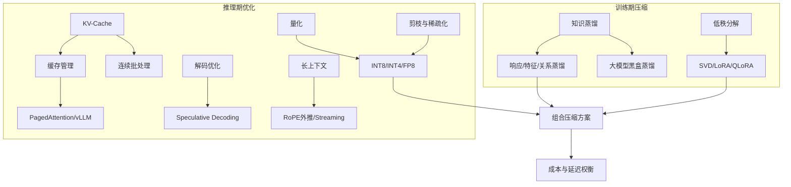

---
tags:
  - 模型压缩
  - 知识蒸馏
  - 大模型推理
  - 推理优化
  - 综述
created: 2025-07-10
updated: 2026-07-10
---

# 模型压缩与高效推理综述

## 领域定义

模型压缩与高效推理关注同一个终极问题的两个阶段：**如何让一个训练好的大模型，以更低的参数量、显存、延迟和成本运行起来**。

- **训练期压缩**（本目录 01-06、14-19）：在模型训练完成后、部署之前，通过知识蒸馏、低秩分解等手段生成一个更小的模型。
- **推理期优化**（本目录 07-10、13）：在不改变（或轻微改变）模型参数的前提下，通过 KV-Cache、量化、剪枝、并行调度等手段降低单次推理的延迟与成本。

两条线目标一致、手段互补，常常组合使用（蒸馏 → 量化 → 剪枝 → 部署），因此合并在同一目录下管理。

> **边界变更说明**：解码与采样策略、长上下文推理策略已迁移至 [[../10_推理算法/00_推理算法_综述|C-10 推理算法]] 域，本域保留系统级推理优化（KV-Cache、量化、剪枝、并行调度、成本权衡）。

## 为什么会出现

大模型进入生产后会立刻暴露出四类约束：

- **参数量过大**：千亿参数模型难以在边缘设备或低成本硬件上运行 → 催生知识蒸馏、低秩分解。
- **计算受限**：自回归生成逐 token 输出，天然串行 → 催生投机解码、并行调度。
- **显存受限**：模型参数和 KV-Cache 同时争夺内存资源 → 催生 KV-Cache 管理、量化、剪枝。
- **带宽受限**：解码阶段往往是 memory-bound，而非 compute-bound → 催生连续批处理、长上下文优化。

因此本方向的目标不是单纯"让模型更小/更快"，而是在质量、延迟、吞吐、稳定性和成本之间建立可用平衡。

## 发展历史

| 年代 | 里程碑 | 类别 | 意义 |
|------|--------|------|------|
| 1989 | Optimal Brain Damage | 剪枝 | 基于二阶信息的经典剪枝方法 |
| 2006 | 模型压缩概念（Buciluǎ et al.） | 蒸馏 | 首次提出将集成模型压缩为单一模型 |
| 2014 | FitNets | 蒸馏 | 特征蒸馏——中间层 hint 训练 |
| 2015 | **知识蒸馏**（Hinton et al.） | 蒸馏 | 软标签蒸馏范式确立 |
| 2015 | Deep Compression（Han et al.） | 剪枝+量化 | 剪枝+量化+编码三步压缩流程 |
| 2019 | MQA | 推理 | 通过减少 KV 头数改善推理效率 |
| 2019 | **DistilBERT** | 蒸馏 | BERT 蒸馏先驱，6层保留97%性能 |
| 2020 | KV-Cache 普及 | 推理 | 成为自回归推理的基础优化 |
| 2020 | **TinyBERT** | 蒸馏 | 两阶段 BERT 蒸馏 |
| 2021 | LoRA（Hu et al.） | 低秩分解 | 低秩适配器，参数高效微调 |
| 2022 | FlashAttention | 推理 | 从 IO 角度重写注意力计算效率 |
| 2022 | LLM.int8() | 量化 | 大模型量化进入工程主流 |
| 2022 | **Progressive Distillation** | 蒸馏 | 扩散模型渐进式减半采样步数 |
| 2023 | GPTQ / AWQ | 量化 | 高质量低比特量化成为实用方案 |
| 2023 | PagedAttention / vLLM | 推理 | KV-Cache 管理进入系统级优化 |
| 2023 | Speculative Decoding | 推理 | 通过草稿模型加速解码 |
| 2023 | **Alpaca / Vicuna / Orca** | 蒸馏 | 大模型能力蒸馏开启 |
| 2023 | SparseGPT / Wanda | 剪枝 | 后训练大模型稀疏化 |
| 2023 | StreamingLLM / GQA / YaRN | 推理 | 长上下文与推理友好架构 |
| 2024 | MLA / Medusa / EAGLE / FP8 | 推理 | KV 压缩、多 token 预测、硬件协同 |
| 2024 | MiniLLM / GKD | 蒸馏 | 反向 KL 散度改进 LLM 蒸馏 |
| 2025 | 蒸馏 + RL 结合（DeepSeek-R1） | 蒸馏 | 蒸馏与强化学习协同提升推理能力 |

## 核心问题

本方向围绕两大类、共九个核心问题展开：

**训练期压缩**：
1. 如何在几乎不损失性能的前提下，将大模型的"暗知识"迁移到小模型（知识蒸馏）？
2. 如何利用权重矩阵的低秩结构减少参数量（低秩分解）？
3. 如何将闭源大模型的能力迁移到开源小模型（黑盒蒸馏）？

**推理期优化**：
4. 如何降低首 token 延迟（Prefill 优化）？
5. 如何降低每 token 成本（Decode 带宽瓶颈）？
6. 如何控制显存占用（参数、KV-Cache、batch 如何共存）？
7. 如何提升吞吐（连续批处理、并行调度）？
8. 如何扩展上下文而不拖垮缓存与延迟？
9. 如何在真实部署中权衡成本与延迟？

## 技术演进路线

整体上，这条路线可理解为：

- **先做知识迁移**：蒸馏和低秩分解在训练/微调阶段就把模型变小。
- **再做推理缓存**：KV-Cache 是所有高效自回归推理的起点。
- **再做数值/结构压缩**：量化和剪枝进一步降低资源占用。
- **再做系统调度**：连续批处理、分页缓存、推理引擎提升整体吞吐。
- **最后做能力边界扩展与权衡**：长上下文、成本-延迟平衡指导最终部署方案。

## 重要分支

### 训练期压缩：知识蒸馏与低秩分解（01-06）

- [[01_知识蒸馏基础]]：教师-学生框架、暗知识、训练方案分类
- [[02_响应蒸馏]]：Hinton 软标签蒸馏、温度参数、KL 散度损失
- [[03_特征蒸馏]]：FitNets、注意力转移、中间层对齐
- [[04_关系蒸馏]]：RKD、SP、CRD、样本间关系迁移
- [[05_自蒸馏与在线蒸馏]]：自蒸馏、在线蒸馏、多教师蒸馏
- [[06_低秩分解与压缩组合]]：SVD、LoRA/QLoRA、量化与低秩分解的组合方案

### 推理期优化：系统级优化（07-13）

- [[07_KV-Cache机制]]：理解推理显存结构与缓存复用的核心入口
- [[08_量化技术]]：INT8、INT4、FP8 等低比特表示如何影响质量与成本
- [[09_剪枝与稀疏化]]：参数冗余如何被结构化利用
- [[10_推理加速与并行]]：并行、调度、连续批处理和系统加速
- [[13_成本与延迟权衡]]：真实部署中的取舍逻辑

> 推理算法层面的解码策略、长上下文策略、投机解码见 [[../10_推理算法/00_推理算法_综述|C-10 推理算法]]。

### 蒸馏应用与工程实践（14-19）

- [[14_NLP与预训练模型蒸馏]]：DistilBERT、TinyBERT、BERT-PKD
- [[15_大模型蒸馏]]：Alpaca、Vicuna、Orca、数据蒸馏、MiniLLM
- [[16_视觉模型蒸馏]]：CNN/ViT 蒸馏、检测/分割蒸馏
- [[17_扩散模型蒸馏]]：LCM、Consistency Models、Progressive Distillation
- [[18_工程实践与框架]]：主流框架工具、实际应用流程、工程注意事项
- [[19_前沿发展]]：数据蒸馏、推理蒸馏、跨模态蒸馏、绿色 AI

## 学习路径

1. **先理解压缩的基本手段**：[[01_知识蒸馏基础]] → [[02_响应蒸馏]]、[[03_特征蒸馏]]、[[04_关系蒸馏]] → [[06_低秩分解与压缩组合]]
2. **再建立推理缓存视角**：[[07_KV-Cache机制]]
3. **理解数值/结构压缩**：[[08_量化技术]] + [[09_剪枝与稀疏化]]
4. **进入系统优化**：[[10_推理加速与并行]]
5. **讨论成本边界**：[[13_成本与延迟权衡]]
6. **按需深入应用场景**：NLP（[[14_NLP与预训练模型蒸馏]]）、大模型（[[15_大模型蒸馏]]）、视觉（[[16_视觉模型蒸馏]]）、生成模型（[[17_扩散模型蒸馏]]）
7. **落地工程实践**：[[18_工程实践与框架]] → [[19_前沿发展]]
8. **推理算法**：解码策略、长上下文策略、投机解码见 [[../10_推理算法/00_推理算法_综述|C-10 推理算法]]

## 当前发展状态

- **蒸馏从压缩手段升级为能力迁移范式**：从 DistilBERT 式的模型压缩，演变为从 GPT-4/o1 蒸馏推理轨迹到开源小模型的核心路径。
- **缓存管理是推理主线**：KV-Cache 决定了长上下文和高并发的现实上限。
- **量化成为默认议题**：不是可选项，而是部署大模型的常规手段。
- **推理引擎正在平台化**：vLLM、TensorRT-LLM、SGLang 等已经不只是库，而是基础设施。
- **架构与推理开始协同设计**：如 GQA、MLA 这类结构本身就是为推理友好而生。

## 未来趋势

- **蒸馏 + RL 结合**：先蒸馏获得初始能力，再用 RL 进一步提升（DeepSeek-R1 路线）。
- **数据蒸馏成为主流**：从蒸馏模型输出转向蒸馏高质量训练数据。
- **分离式推理更普及**：Prefill/Decode 将进一步解耦。
- **多 token 预测继续发展**：突破逐 token 解码上限。
- **FP8 与新硬件协同增强**：推理优化越来越依赖硬件原生支持。
- **多模态压缩与推理融合**：未来系统需同时压缩和高效处理文本、图像、音频。

## 与 K-03 推理工程的边界

本目录关注**推理算法与压缩原理**：为什么量化会有精度损失、KV-Cache 如何组织、剪枝如何选择结构、蒸馏损失如何设计。

生产环境的**容量规划、服务化 SRE 实践、推理引擎选型与集群运维**属于工程系统问题，见 [[../../K_AI工程化/03_推理工程/00_推理工程_综述|K-03 推理工程]]；LLM 应用层的成本治理、可观测性见 [[../../K_AI工程化/06_LLMOps与AgentOps/00_LLMOps与AgentOps综述|K-06 LLMOps 与 AgentOps]]。

## 相关方向

- [[../02_语言基础模型/03_大语言模型核心架构/00_大语言模型核心架构_综述|大语言模型核心架构]]：决定哪些结构天然更适合压缩与推理
- [[../../B_连接主义与深度学习/08_Transformer与注意力机制/00_Transformer与注意力机制_综述|Transformer 与注意力机制]]：解释注意力计算为何成为核心瓶颈
- [[../06_模型训练与对齐/00_大模型训练与对齐_综述|大模型训练与对齐]]：LoRA/QLoRA 参数高效微调、蒸馏数据来源
- [[../10_推理算法/00_推理算法_综述|C-10 推理算法]]：解码策略、投机解码、长上下文策略等推理算法
- [[../../K_AI工程化/03_推理工程/00_推理工程_综述|K-03 推理工程]]：把压缩与推理优化纳入完整服务系统

## References

### 综述论文

- Gou, J. et al. (2021). *Knowledge Distillation: A Survey*. IJCV, 129, 1789–1819.
- Cheng, X. et al. (2020). *A Survey of Model Compression and Acceleration for Deep Neural Networks*. arXiv:1710.09282.

### 奠基论文

- Hinton, G. et al. (2015). *Distilling the Knowledge in a Neural Network*. arXiv:1503.02531.
- Buciluǎ, C., Caruana, R. & Niculescu-Mizil, A. (2006). *Model Compression*. KDD.
- Sanh, V. et al. (2019). *DistilBERT*. arXiv:1910.01108.

### 推理优化关键论文

- Dao et al., *FlashAttention* (2022)
- Dettmers et al., *LLM.int8()* (2022)
- Frantar et al., *GPTQ* (2023)
- Lin et al., *AWQ* (2024)
- Kwon et al., *PagedAttention / vLLM* (2023)
- Leviathan et al., *Speculative Decoding* (2023)
- Xiao et al., *StreamingLLM* (2023)

### 大模型蒸馏关键论文

- Taori, R. et al. (2023). *Stanford Alpaca*.
- Mukherjee, S. et al. (2023). *Orca: Progressive Learning from Complex Explanation Traces of GPT-4*. arXiv:2306.02707.
- DeepSeek-AI (2025). *DeepSeek-R1*. arXiv:2501.12948.
- Gu, D. et al. (2024). *MiniLLM*. ICLR.

### 开源项目

- [vLLM 官方文档](https://docs.vllm.ai/)
- [TensorRT-LLM 官方仓库](https://github.com/NVIDIA/TensorRT-LLM)
- [Hugging Face Transformers](https://github.com/huggingface/transformers)
- [Alpaca](https://github.com/tatsu-lab/stanford_alpaca)
