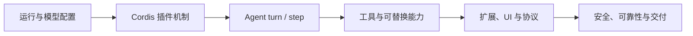

# DeepSeek Harness 综述

## 一句话理解

**DeepSeek Harness（DSH）** 是一个以 Cordis 插件运行时为底座的 Agent Harness：模型、工具、会话日志、Agent 循环、Web UI 与安全策略均可通过配置组合、替换和卸载，而非依赖不可替换的特权核心。

## 领域定义

Harness 不是单一聊天应用，也不等同于某个大语言模型。它提供 Agent 的运行底座：把用户输入、模型流式响应、工具执行、审批与会话持久化组织为可恢复、可观察且可扩展的运行过程。

## 为什么会出现

面向真实任务的 Agent 同时需要模型路由、文件与进程操作、权限控制、会话回放、客户端呈现和多种部署形态。把这些能力写死会使替换模型、迁移执行环境或增加产品功能都需要修改核心。DSH 以插件、副作用自动清理和服务 seam 将这些变化降为组合问题。

## 核心问题

1. 如何把模型输出可靠地转化为受策略约束的真实操作？
2. 如何让模型所见上下文、会话回放和 UI 时间线保持一致？
3. 如何允许同一能力的本地、远程或沙箱提供方相互替换？
4. 如何在不修改 Agent Loop 的情况下扩展策略、产品和协议？

## 技术演进路线

## 重要分支

- [[01_入门与运行/01_DeepSeek_Harness_定位与学习路径|入门与运行]]：Web UI、提供方、SDK 与会话工作区。
- [[02_Cordis插件框架/01_Cordis_核心模型|Cordis 插件框架]]：生命周期、服务、事件、配置与作用域。
- [[03_Agent运行时与会话/01_Agent_Turn与Step生命周期|Agent 运行时与会话]]：Turn/Step、事件日志、提示词与控制状态。
- [[04_工具与可替换能力/01_工具定义_Schema与执行契约|工具与能力]]：工具契约、流水线、seam 与 LLM 适配器。
- [[05_扩展与客户端集成/01_插件开发与调试|扩展与客户端集成]]：Package、Bundle、Conversation Node、子代理和工作流。
- [[06_安全可靠性与工程化/01_审批权限与沙箱|安全可靠性与工程化]]：审批、沙箱、恢复、不变式和测试。

## 学习路径

1. 先完成 [[01_入门与运行/02_安装启动与运行配置]]，能启动一个受隔离工作区约束的会话。
2. 学习 [[02_Cordis插件框架/01_Cordis_核心模型]] 与 [[02_Cordis插件框架/04_事件系统与分发语义]]，理解扩展的基本语法和生命周期。
3. 阅读 [[03_Agent运行时与会话/01_Agent_Turn与Step生命周期]]，建立“日志驱动模型历史”的全局视角。
4. 按 [[04_工具与可替换能力/05_执行能力_文件Shell终端与Web]] 开始扩展模型动作，再决定是否需要 [[04_工具与可替换能力/03_Capability_Seam_设计模式]]。
5. 最后学习 UI、协议、测试和安全边界，形成可交付的 Agent 产品能力。

## 核心术语

DSH 为每个概念规定一个规范术语，与具体包名和实现细节分离。以下是全局性核心术语；子系统专有术语见对应笔记。

### 循环层级

| 术语 | 定义 |
|---|---|
| **Turn（轮次）** | 会话中对一批已接纳输入的排空过程，在模型及工具停止工作或终止策略介入后结束 |
| **Step（步骤）** | 一次模型请求 + 由模型响应引发的工具执行；一个 Turn 包含零个或多个 Step |
| **Round** | 承载一个 Turn 的外层策略迭代（如一个 Goal Round 或一次 Ralph 尝试）；Round 计数器归该策略所有，不统计会话中的每个 Turn |

### Agent 作用域

| 术语 | 定义 |
|---|---|
| **agent-scope** | 按 agent 划分的注册单位；贡献（工具/提示词段/变量/限制/监听器）要么全局可见，要么归属于恰好一个 scope key |
| **scope key** | scope 的不透明标识，按对象同一性比较；一个活跃的 agent 就是其自身 scope 的 key |
| **agent.ctx** | agent 的带作用域上下文；通过它进行的注册既具有 scope 可见性，其生命周期也绑定到该 scope |
| **scope carrier** | scope 过滤分发所携带的 `thisArg`；其过滤器放行无标签监听器加上主体自身的监听器 |
| **scoped dispatch** | 关于某个 agent 的活动的事件以该 agent 的 carrier 进行分发；关于注册表本身的事件（「一个工具被添加了」）保持不过滤 |
| **shadowing** | 最具体者胜出的名称解析：带作用域的工具/片段/变量仅在该 scope 内替换同名的全局对应项；是按 agent 定制 persona 和工具变体的机制 |
| **restriction** | `tools.restrict()` 为单个 scope 过滤全局工具集合，多个 restriction 取交集；被过滤的工具既不出现在提示词中，也拒绝执行 |
| **setup window** | 创建者组装 agent 作用域环境的创建时隙（`CreateAgentOptions.setup`）：scope 和 agent 对象已存在，但 agent/会话尚未发布；只做注册，从不驱动 agent |
| **lineage** | 以数据形式携带的父子关系事实（`parentSession`、`delegationDepth`、`subagentDepth`）；从不影响可见性，从不通过 scope 结构表达 |

### 目标（Goal）

| 术语 | 定义 |
|---|---|
| **目标** | 附着在现有会话上的单个持久完成目标，带 `active/paused/blocked/complete` 阶段和 Goal Round 上限；不是调度器，也不是独立对话 |
| **Goal Round** | 为当前目标接纳的一次续行周期；同会话驱动器将其具体化为一个由目标触发的 Turn，无关的人类 Turn 不消耗 Goal Round 上限 |
| **目标激活** | 续行消费方接纳下一个 Goal Round 的进程本地权限（`armed/disarmed`）；有意不参与持久回放，恢复或 fork 后须经人类授权的恢复变更才能重启自动工作 |

### Ralph 循环

| 术语 | 定义 |
|---|---|
| **Ralph 循环** | 面向不可变目标的前台全新 agent 工作流运行；由 workflow 和 subagent 原语组合而成的面向模型的工具策略，不是同会话目标、agent loop 模式或通用工作流脚本功能 |
| **Ralph Round** | Ralph 循环中的一个全新子会话；子会话不接收父会话或此前子会话的对话种子；共享工作区和一份有界的 Ralph 交接承载跨 Round 的状态 |
| **Ralph 交接** | 从一个仍需继续的 Ralph Round 传给下一个的规范化有界结构化报告，包含状态、摘要、证据、后续步骤和阻塞说明；补充共享工作区而不取代它 |

### 人类命令与 Capability Seam

| 术语 | 定义 |
|---|---|
| **人类命令** | 以斜杠开头的指令（如 `/goal`），由 `ctx.commands` 解释执行，不成为模型消息，不同于面向模型的工具和 shell 命令 |
| **命令平面** | 由 UI 适配器和命令插件负责的发现、解析、分发、取消与结果渲染机制；命令输出属于 UI 状态 |
| **capability-seam** | 可替换能力的三角结构：Service Definition（拥有 `ctx.<key>` 的 Cordis `Service`）+ 一个或多个 Service Provider + 一个或多个 Consumer；seam 是完整能力，不是其中任一角色 |

## 当前状态与边界

官方将 DSH 标为技术预览；插件 API、配置字段与持久化格式可能演进。笔记解释稳定设计原则；精确类型、工具 Schema 与配置默认值应回到官方生成目录和当前源码核验。

## 事件生产方/消费方矩阵

DSH 所有事件按派发方、监听方和模式组织在 `docs/event-producer-consumer.zh.md`。这是理解哪些包参与了某个关键扩展点的权威索引。关键要点：

- **会话事件**（`session/event`）：约 23 个监听方，包括持久化、投影、遥测、压缩等；
- **`agent/pre-step`（waterfall）**：约 13 个监听方，包括 plan-mode、compaction-basic、skill 工具、hooks、agent-instructions、goal-round-driver、repeat-tool-reminder、session-checkpoint-policy、time-context、tmux-context、tool-cordis 等；
- **`tools/pre-execute`/`tools/execute`/`tools/post-execute`**：构成完整的工具流水线策略链；
- **`workflow/*` 事件**：仅供观察的生命周期通知，订阅者异常被隔离。

精确的生产方/消费方关系见 [[07_子系统参考地图]] 和 [[02_Cordis插件框架/04_事件系统与分发语义]]。

## 相关知识

- [[01_入门与运行/01_DeepSeek_Harness_定位与学习路径]]
- [[02_Cordis插件框架/01_Cordis_核心模型]]
- [[07_子系统参考地图]]

## References

- [DeepSeek Harness 文档站](https://deepseek-harness.github.io/deepseek-harness/)
- `D:\_Projects\deepseek-harness\docs\architecture.zh.md`
- `D:\_Projects\deepseek-harness\docs\glossary.zh.md`
