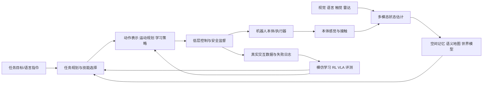

---
tags:
  - 具身智能
  - Embodied-AI
  - VLA
  - 机器人学习
  - 世界模型
created: 2025-07-14
updated: 2026-07-28
---

# 具身智能综述：让智能在物理世界闭环行动

## 1. 定义与边界

具身智能（Embodied Intelligence / Embodied AI）研究具有身体的智能体，如何在真实或高保真交互环境中，通过**感知—状态估计—预测/记忆—决策—控制—反馈学习**的闭环完成任务。

它不是“机器人学 + 大模型”的简单叠加，也不等价于人形机器人。一个具身系统可以是机械臂、移动底盘、四足、无人机、人形机器人，甚至虚拟环境中的 Agent；关键在于它必须有可作用于环境的动作、从行动后果获得反馈的观测，以及受物理、时延和安全约束的闭环。

> 具身智能的难点不在于让模型说出“应该做什么”，而在于让系统在不确定世界中**可靠地做到、知道何时做不到，并能恢复或安全停止**。

## 2. 为什么这是独立问题

语言模型的输出主要在符号空间中被评估；具身系统的输出会产生不可逆或有风险的物理后果。例如“把杯子放进洗碗机”需要同时完成对象指代、三维定位、可达性判断、抓取、避障、接触控制、放置、结果核验与失败恢复。任何一环出错都可能使语义上正确的计划变成物理上不可行的行为。

具身难题可归结为五个相互耦合的鸿沟：

| 鸿沟 | 本质 | 典型表现 | 需要的能力 |
|---|---|---|---|
| 符号—几何 | 语言目标缺少精确空间约束 | “左边”“那个杯子”无法直接执行 | 视觉语言落地、3D 表征、坐标变换 |
| 感知—状态 | 世界部分可观测且动态 | 遮挡、滑移、传感器漂移 | 时序融合、主动感知、不确定性 |
| 计划—控制 | 高层计划不能直接驱动电机 | IK 无解、碰撞、延迟、接触冲击 | TAMP、技能、控制与安全约束 |
| 仿真—现实 | 数据与动力学分布不一致 | 摩擦、光照、回差导致失效 | 域随机化、系统辨识、真机闭环 |
| 成功—可靠 | 单次演示不等于工程可用 | 新物体/扰动/长任务失败 | 泛化、恢复、审计与安全治理 |

## 3. 统一问题形式

从决策角度看，具身智能通常是目标条件的部分可观测控制问题：

$$s_{t+1}\sim p(s_{t+1}\mid s_t,a_t),\qquad o_t\sim p(o_t\mid s_t),\qquad a_t\sim\pi(a_t\mid o_{\le t},g)$$

其中 \(s_t\) 是真实世界状态，\(o_t\) 是多模态观测，\(g\) 是语言或结构化目标，\(a_t\) 是受本体和安全约束的动作。真正的目标并非只最大化成功率，而是在约束下优化任务效用：

$$\max_\pi\;\mathbb E[R(\tau)]\quad\text{s.t.}\quad \Pr(\text{unsafe}\mid\pi)\le\delta,\;a_t\in\mathcal A_{safe}$$

这解释了为什么大模型、规划器、控制器和安全层都不可缺少：它们分别处理语义泛化、连续可行性、高频稳定和风险边界。

## 4. 技术全景：闭环而非模块清单

| 层次 | 核心问题 | 典型方法 | 不能被替代的原因 |
|---|---|---|---|
| 本体与接触 | 机器人能做什么、如何受力 | 运动学、动力学、IK、抓取、WBC | 决定动作可行域与风险上限 |
| 感知与状态 | 现在发生什么、置信度多高 | 视觉/触觉/语言融合、滤波、位姿估计 | 仅靠单帧语义无法安全行动 |
| 空间与预测 | 环境如何组织、行动后果如何 | SLAM、语义地图、3D 表征、世界模型 | 支撑跨视角记忆、规划和恢复 |
| 决策与学习 | 接下来做什么、如何泛化 | TAMP、行为树、IL、RL、扩散策略、VLA | 连接开放目标与可复用技能 |
| 执行与治理 | 如何稳定、安全、可复现 | PID/MPC/阻抗、ROS 2、仿真、日志 | 决定系统是否能在真实世界交付 |

## 5. 主要技术范式与正确用法

### 5.1 经典模块化机器人系统

感知、定位、规划和控制分工清晰，优点是可解释、可验证、便于调试，特别适合结构化环境、明确几何约束和安全要求高的场景。短板是模块接口可能传递误差，开放语义任务需要较多人工建模。

### 5.2 端到端机器人学习

行为克隆、强化学习和扩散策略从示教或交互数据中学习观测到动作的映射。它们擅长复杂接触、难以手工建模的视觉操作和连续技能；但数据覆盖、分布偏移、失败恢复与安全验证是硬约束。

### 5.3 Vision-Language-Action（VLA）与具身基础模型

VLA 使用图像/视频、语言、本体状态和历史信息生成机器人动作。RT-2 展示了视觉语言知识向机器人控制的迁移；Open X-Embodiment/RT-X 推动跨机器人数据规模化；OpenVLA 提供开源训练与适配基线。其核心价值是开放语义与多任务泛化，而非替代控制、标定、碰撞检查或接触反馈。

### 5.4 世界模型、Agent 与分层混合架构

世界模型为行动提供后果预测；语言 Agent 擅长任务分解与知识调用；技能策略负责局部操作；经典控制器负责高频稳定。实践上最可靠的结构往往是：

> 语言模型提出目标和候选技能 → 语义地图/世界模型提供上下文 → 规划器验证连续可行性 → 学习策略处理感知与接触 → 控制与安全层做最终裁决。

## 6. 当前研究主线与未解决问题

| 主线 | 进展 | 根本瓶颈 |
|---|---|---|
| 通用操作与 VLA | 多任务、语言条件与跨数据训练进展快 | 动作标准不统一、真实数据稀缺、毫米级精度不足 |
| 灵巧手与触觉 | 触觉表征、在手操作、接触学习发展中 | 高维接触、传感器耐久性、数据采集成本 |
| 人形/全身智能 | 行走、平衡、双臂协作与长程任务结合 | 欠驱动、能耗、安全、硬件可靠性与数据量 |
| 空间智能/世界模型 | 语义地图、3D 表征、预测学习丰富 | 长时预测、动态场景、物理因果与在线更新 |
| Sim-to-real | GPU 并行仿真与域随机化成熟 | 柔性/接触、视觉和系统时延仍有现实差距 |
| 安全与评测 | 开始关注恢复、干预和真实评测 | 统一任务定义、风险指标、可复现真机基准不足 |

需要避免两种误判：一是把 VLA 的语言泛化误当作通用物理能力；二是把某个仿真 benchmark 的成功率误当作真实部署可靠性。

## 7. 数据、基准与评测方法论

### 数据层

高价值数据不是只包含成功轨迹，而应同时包含多视角视觉、触觉/力、本体状态、动作定义、标定与时间戳、语言目标、阶段标签、安全事件、失败类别、恢复过程和人工干预。数据切分应按物体、场景、指令模板和时间划分，避免随机切帧造成泄漏。

### 基准层

具身评测可覆盖导航、抓取、桌面操作、移动操作、长程家居任务、全身控制与人机协作。应同时报告：

- **任务能力**：成功率、完成时长、能耗、技能复用。
- **泛化能力**：新物体、新布局、新指令、新相机/光照、跨本体。
- **鲁棒与恢复**：遮挡、滑移、扰动、传感器丢帧和动态障碍下的恢复率。
- **安全性**：碰撞、超力/超速、急停、近失误、人工接管。
- **工程性**：端到端延迟、控制频率、训练/真机数据成本、可复现性。

单一成功视频、单一环境平均分或仅报告模型参数量都不足以说明具身能力。

## 8. 工程选型指南

| 起点与目标 | 推荐组合 | 首要验证点 |
|---|---|---|
| 工业/仓储固定流程 | 结构化感知 + 规划 + 伺服/力控 | 标定、节拍、故障恢复和安全认证 |
| 单机械臂视觉抓放 | RGB-D/位姿 + MoveIt + IL/扩散策略 | 坐标系、抓取闭环、数据与时延 |
| 四足/人形运动 | 状态估计 + WBC/MPC + RL 残差 | 接触安全、仿真保真、能耗和跌倒恢复 |
| 开放指令多任务 | VLM/VLA + 语义地图 + 技能库 + TAMP | 指令落地、动作接口、OOD 与权限 |
| 长程家居 Agent | 对象地图 + 行为树/任务规划 + 局部策略 | 记忆更新、前后置条件、失败恢复 |

如果没有先验闭环，正确起点不是训练最大的 VLA，而是选定一个任务，明确成功标准、状态、动作接口、控制频率和安全边界，再收集对该闭环真正有用的数据。

## 9. 章节导航与学习路线

### 知识导航

#### 核心闭环（01–05）

1. [[01_具身基础_本体与动力学]]：理解本体、动作空间、运动/接触约束与控制边界。
2. [[02_多模态具身感知]]：建立可靠的多模态状态、标定、时序融合与主动感知能力。
3. [[04_空间智能与世界模型]]：学习定位、语义地图、3D 表征、预测与重规划。
4. [[03_行动表示与具身决策]]：连接任务规划、IL/RL、扩散策略、VLA 与评测。
5. [[05_具身执行_控制与系统工程]]：完成 ROS 2、仿真、真机、安全和数据闭环。

#### 扩展主题（06–11）

6. [[06_具身认知理论与感知行动耦合]]：认知科学根源、可供性、感知—行动循环、预测编码与主动推断。
7. [[07_数据工程与采集]]：遥操作、数据规范、跨本体数据、Open X-Embodiment 与数据效率。
8. [[08_人形机器人与灵巧操作]]：全身控制、灵巧手、触觉闭环、移动操作与硬件进展。
9. [[09_具身Agent与任务规划]]：LLM Agent、技能库、TAMP、行为树、记忆与执行监控。
10. [[10_仿真平台与实践路线]]：MuJoCo/ManiSkill/Isaac Lab/Habitat、评测基准与从零上手。
11. [[11_前沿综述与发展脉络]]：发展历史、产业图景、开放问题与研究趋势。

### 四阶段学习路径

1. **机器人闭环基础**：线性代数/概率/优化 → 坐标变换、运动学、控制 → ROS 2 与仿真；先复现一个传统抓放或导航闭环。
2. **机器人学习能力**：行为克隆、离线 RL、视觉表征、扩散策略、域随机化；掌握数据规范和真实/仿真评测差异。
3. **通用具身系统**：VLM/VLA、语义地图、TAMP、世界模型、长程恢复与安全治理；重点研究混合架构，而不是仅做模型调用。
4. **前沿与全景**：理解具身认知理论、数据工程、人形/灵巧操作、Agent 规划、仿真实践和发展脉络；建立对领域边界的判断力。

## 10. 与其他方向的关系

- [[../13_强化学习/00_强化学习_综述|强化学习]]：策略优化、探索、离线学习和模型预测控制的学习基础。
- [[../14_多模态AI/00_多模态AI|多模态AI]]：视觉—语言对齐与基础模型能力来源。
- [[../15_计算机视觉/00_计算机视觉_综述|计算机视觉]]：检测、分割、6D 位姿、3D 重建与跟踪基础。
- [[../19_LLM应用工程/04_Agent系统/00_Agent系统|Agent系统]]：高层任务分解、记忆和工具编排；在具身场景必须受物理执行层约束。
- [[../17_AI安全与对齐/00_AI安全与对齐_综述|AI安全与对齐]]：现实行动中的风险边界、监督和审计。

## References

### 核心论文与书籍

- Lynch & Park, *Modern Robotics*
- Thrun, Burgard & Fox, *Probabilistic Robotics*
- Brohan et al., *RT-2: Vision-Language-Action Models Transfer Web Knowledge to Robotic Control*
- Driess et al., *PaLM-E: An Embodied Multimodal Language Model*
- Open X-Embodiment Collaboration, *Open X-Embodiment*
- Kim et al., *OpenVLA: An Open-Source Vision-Language-Action Model*
- Chi et al., *Diffusion Policy*
- Hafner et al., *DreamerV3*

### 工程与实验平台

- [RT-2 项目页](https://robotics-transformer2.github.io/)
- [OpenVLA 项目页](https://openvla.github.io/)
- [MoveIt 2 Documentation](https://moveit.picknik.ai/main/index.html)
- [ManiSkill](https://maniskill.ai/)